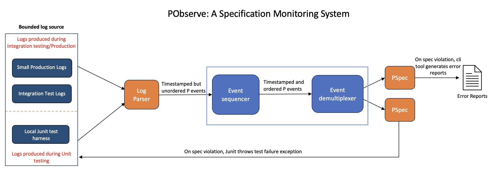

# PObserve

Teams across AWS have been using P to validate correctness of their system and find critical corner case bugs early on during the design phase itself rather than in testing or production. However, the key question that was repeatedly raised by service teams was: *"Design validation is super valuable, finds critical bugs early! But it's the implementation that gets shipped (and not design), how do we connect our design-level specifications to implementation?"*

!!! note ""
    How to integrate checking formal specifications across all the phases of development cycle (and not just design time)?

We mold the above mentioned challenge of integrating checking formal specifications across all the phases of development cycle as a systems observability problem:

!!! note ""
    Improving developers' visibility into systems behavior using the lens of formal specifications. Service teams can use PObserve to observe if their system satisfies the correctness specification during design, testing, and in production.

PObserve is a distributed runtime monitoring framework that allows checking formal correctness specifications on systems implementation using service logs. As PObserve operates on service logs, it does not require any additional instrumentation to assert design-level correctness specification on the implementation.

??? question "[Architecture] How does PObserve work?"

    The figure above provides an overview of the PObserve architecture. Given a small collection of service logs (generated during integration testing or in production), PObserve requires two additional inputs (represented in orange): (1) [PObserve Log Parser](./logparser.md) to parse service logs and generate PObserve events, and (2) P specifications (global invariants) that must be checked on these service logs.

    * PObserve first parses the service logs to generate a sequence of time-stamped PObserve events 
    * Time-stamped events are then fed into a sequencer that aggregates a globally sorted stream of time-stamped events (to capture a global view of the system)
    * Sorted events are then consumed by a demultiplexer that distributes the required events to each P Specification based on the events that it observes or monitors. The stream processing block in the figure is implemented using Java Streams

!!! info ""
    Read the [Getting Started](./gettingstarted.md) page for how to use PObserve
