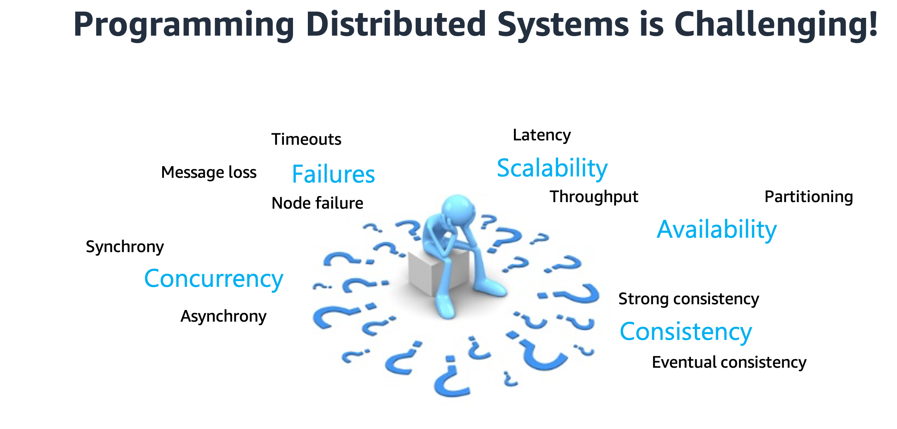

{ align=center }

Distributed systems are notoriously hard to get right as the programmer needs to reason about numerous control paths resulting from the myriad interleaving of events (or messages) and failures.
Unsurprisingly, it is easy to introduce subtle errors while attempting to fill in gaps between high-level system specifications and their
concrete implementations. In practice, it is extremely difficult to test asynchronous systems, most control paths remain untested, and serious bugs lie dormant for months or even years after deployment.

!!! quote ""
    _The P programming framework takes several steps towards addressing these challenges_. 

## P Framework

P is a unified framework for modeling, specifying, implementing, testing and verifying complex distributed systems. 
The P framework can be divided into three important parts:

{ align=center }

### P Language

### Backend Analysis Engines

### Code Generation