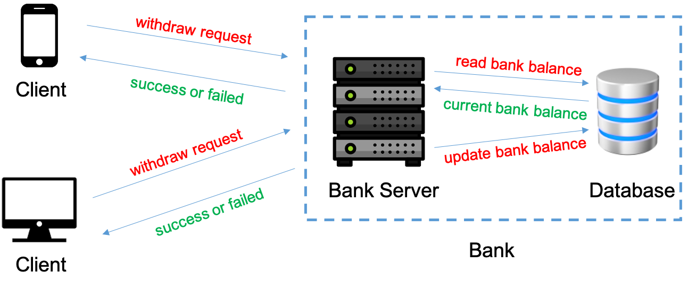

??? note "How to use this example"

    We assume that you have cloned the P repository locally.
    ```shell
    git clone https://github.com/p-org/P.git
    ```

    The recommended way to work through this example is to open the [P/Tutorial](https://github.com/p-org/P/tree/master/Tutorial) folder in IntelliJ side-by-side a browser using which you can simultaneously read the description for each example and browse the P program.

    To know more about P language primitives used in the example, please look them up in the [language manual](../manualoutline.md).

**System:** We consider a client-server application where clients interact with a bank to withdraw money from their accounts.

{ align=center }

The bank consists of two components: (1) a bank server that services withdraw requests from the client; and (2) a backend database which is used to store the account balance information for each client.
Multiple clients can concurrently send withdraw requests to the bank. On receiving a withdraw request, the bank server reads the current bank balance for the client and if the withdraw request is allowed then performs the withdrawal, updates the account balance, and responds back to the client with the new account balance.

**Correctness Specification:** The bank must maintain the invariant that each account must have at least 10 dollars as its balance. If a withdraw request takes the account balance below 10 then the withdraw request must be rejected by the bank. The correctness property that we would like to check is that in the presence of concurrent client withdraw requests the bank always responds with the correct bank balance for each client and a withdraw request always succeeds if there is enough balance in the account (that is, at least 10).

### P Project

The [1_ClientServer](https://github.com/p-org/P/tree/master/Tutorial/1_ClientServer) folder contains the source code for the [ClientServer](https://github.com/p-org/P/blob/master/Tutorial/1_ClientServer/ClientServer.pproj) project. Please feel free to read details about the recommended [P program structure](../advanced/structureOfPProgram.md) and [P project file](../advanced/PProject.md).

### Models

The P models ([PSrc](https://github.com/p-org/P/tree/master/Tutorial/1_ClientServer/PSrc)) for the ClientServer example consist of four files:

- [Client.p](https://github.com/p-org/P/blob/master/Tutorial/1_ClientServer/PSrc/Client.p): Implements the Client state machine.

??? tip "[Expand]: Let's walk through Client.p"
    - ([L19 - L22](https://github.com/p-org/P/blob/master/Tutorial/1_ClientServer/PSrc/Client.p#L19-L22))  &rarr; Events `eWithDrawReq` and `eWithDrawResp` are used to communicate between the `Client` and the `Server` machines (manual: [event declaration](../manual/events.md)).
    - ([L3 - L17](https://github.com/p-org/P/blob/master/Tutorial/1_ClientServer/PSrc/Client.p#L3-L17)) &rarr; Declares the payload types for the `eWithDrawReq` and `eWithDrawResp` events (manual: [user defined type](../manual/datatypes.md#user-defined)).
    - ([L25 - L95](https://github.com/p-org/P/blob/master/Tutorial/1_ClientServer/PSrc/Client.p#L25-L95))  &rarr; Declares the `Client` state machine (manual: [P state machine](../manual/statemachines.md)).
        - The `Client` machine has a set of local variables used to store the local-state of the state machine ([L27 - L31](https://github.com/p-org/P/blob/master/Tutorial/1_ClientServer/PSrc/Client.p#L27-L31)). `Init` state is the start state of the machine where the machine starts executions on being created. The entry function of the `Init` state initializes the local variables based on the parameters received on creation and jumps to the `WithdrawMoney` state.
        - In the `WithdrawMoney` state, the state machine checks if there is enough money in the account. If the balance is greater than 10 then it issues a random withdraw request to the bank by sending the `eWithDrawReq` event ([L55](https://github.com/p-org/P/blob/master/Tutorial/1_ClientServer/PSrc/Client.p#L55)) otherwise it jumps to the `NoMoneyToWithDraw` state. After sending a withdraw request, the machine waits for the `eWithDrawResp` event ([L59](https://github.com/p-org/P/blob/master/Tutorial/1_ClientServer/PSrc/Client.p#L59)). On receiving the `eWithDrawResp` event, the machine executes the corresponding event handler that confirms if the bank response is as expected and also if there is still money in the account then jumps back to the WithdrawMoney state. Note that each time we (re-)enter a state (through a transition or goto statement), its entry function is executed.


- [Server.p](https://github.com/p-org/P/blob/master/Tutorial/1_ClientServer/PSrc/Server.p): Implements the BankServer and the backend Database state machines.

??? tip "[Expand]: Let's walk through Server.p"
    - ([L1 - L7](https://github.com/p-org/P/blob/master/Tutorial/1_ClientServer/PSrc/Server.p#L1-L7)) &rarr; Declares the events used to communicate between the bank server and the backend database.
    - ([L9 - L48](https://github.com/p-org/P/blob/master/Tutorial/1_ClientServer/PSrc/Server.p#L9-L48)) &rarr; Declares the `BankServer` machine. The BankServer machine uses a database machine as a service to store the bank balance for all its clients.
    On receiving an eWithDrawReq (withdraw requests) from a client, it reads the current balance for the account,
    if there is enough money in the account then it updates the new balance in the database after withdrawal
    and sends a response back to the client.
    - ([L50 - L74](https://github.com/p-org/P/blob/master/Tutorial/1_ClientServer/PSrc/Server.p#L50-L74)) &rarr; Declares the `Database` machine. The Database machine acts as a helper service for the Bank server and stores the bank balance for
    each account. There are two API's or functions to interact with the Database: ReadBankBalance and UpdateBankBalance. These functions are implemented as global functions in P ([L76 - L92](https://github.com/p-org/P/blob/master/Tutorial/1_ClientServer/PSrc/Server.p#L76-L92)).

- [AbstractBankServer.p](https://github.com/p-org/P/blob/master/Tutorial/1_ClientServer/PSrc/AbstractBankServer.p): Implements the AbstractBankServer state machine that provides a simplified abstraction that unifies the BankServer and Database machines. We will demonstrate how one can replace the complex bank service (consisting of two interacting components, the BankServer and the Database) by its abstraction when checking the client application.

??? tip "[Expand]: Let's walk through AbstractBankServer.p"
    - ([L12 - L37](https://github.com/p-org/P/blob/master/Tutorial/1_ClientServer/PSrc/AbstractBankServer.p#L12-L37)) &rarr; Declares an abstraction of the BankServer machine. The `AbstractBankServer` provides an implementation of the Bank where
    the interaction between the BankServer and Database is abstracted away. We use the `AbstractBankServer` machine to demonstrate how one can replace a complex component in P with an abstraction that hides a lot of its internal complexity. For the client, it still exposes the same interface or behavior. Hence, when checking the correctness of the client it does not matter whether we pair it with the BankServer or the AbstractBankServer.

!!! info "Key Takeaway"
    To mitigate the state space explosion problem, when modeling and checking complex systems consisting of several components, we would like to check the correctness of each component in isolation. When doing this kind of a compositional reasoning, we replace the environment of the component with its abstraction. The abstraction basically exposes the same interface as the environment but removes its internal complexity, simplifying the overall problem of checking the correctness of the component under test. There is a large body of literature on doing compositional reasoning of distributed systems. You can start with [the Modular P paper](https://ankushdesai.github.io/assets/papers/modp.pdf). How to automatically replace a machine with its abstraction is described below.

- [ClientServerModules.p](https://github.com/p-org/P/blob/master/Tutorial/1_ClientServer/PSrc/ClientServerModules.p): Declares the P modules corresponding to each component in the system.

??? tip "[Expand]: Let's walk through ClientServerModules.p"
    - ([L1 - L5](https://github.com/p-org/P/blob/master/Tutorial/1_ClientServer/PSrc/ClientServerModules.p#L1-L5)) &rarr; Declares the `Client` and `Bank` modules. A module in P is a collection of state machines that together implement that module or component. A system model in P is then a composition or union of modules. The `Client` module consists of a single machine `Client` and the `Bank` module is implemented by machines `BankServer` and `Database` together (manual: [P module system](../manual/modulesystem.md)).
    - ([L7 - L8](https://github.com/p-org/P/blob/master/Tutorial/1_ClientServer/PSrc/ClientServerModules.p#L7-L8)) &rarr; The `AbstractBank` module uses the `binding` feature in P modules to bind the `BankServer` machine to the `AbstractBankServer` machine. Basically, what this implies is that whenever `AbstractBank` module is used the creation of the `BankServer` machine will result in creation of `AbstractBankServer`, replacing the implementation with its abstraction (manual: [primitive modules](../manual/modulesystem.md#primitive-module)).

### Specifications

The P Specifications ([PSpec](https://github.com/p-org/P/blob/master/Tutorial/1_ClientServer/PSpec)) for the ClientServer example are implemented in the [BankBalanceCorrect.p](https://github.com/p-org/P/blob/master/Tutorial/1_ClientServer/PSpec/BankBalanceCorrect.p) file. We define two specifications:

- **BankBalanceIsAlwaysCorrect** (safety property): The BankBalanceIsAlwaysCorrect specification checks the global invariant that the account-balance communicated to the client by the bank is always correct and the bank never removes more money from the account than that withdrawn by the client! Also, if the bank denies a withdraw request then it is only because the withdrawal would reduce the account balance to below 10.
- **GuaranteedWithDrawProgress** (liveness property): The GuaranteedWithDrawProgress specification checks the liveness (or progress) property that all withdraw requests submitted by the client are eventually responded.

!!! info ""
    Stating that BankBalanceIsAlwaysCorrect checks that "if the bank denies a withdraw request then the request would reduce the balance to below 10 (< 10)" is equivalent to state that "if there is enough money in the account - at least 10 (>= 10), then the request must not error". Hence, the two properties BankBalanceIsAlwaysCorrect and GuaranteedWithDrawProgress together ensure that every withdraw request if allowed will eventually succeed and the bank cannot block correct withdrawal requests.

??? tip "[Expand]: Let's walk through BankBalanceCorrect.p"
    - ([L20](https://github.com/p-org/P/blob/master/Tutorial/1_ClientServer/PSpec/BankBalanceCorrect.p#L20)) &rarr; Event `eSpec_BankBalanceIsAlwaysCorrect_Init` is used to inform the monitors about the initial state of the Bank. The event is announced by the TestDrivers when setting up the system ([here](https://github.com/p-org/P/blob/master/Tutorial/1_ClientServer/PTst/TestDriver.p#L51)).
    - ([L36 - L86](https://github.com/p-org/P/blob/master/Tutorial/1_ClientServer/PSpec/BankBalanceCorrect.p#L36-L86)) &rarr; Declares the `BankBalanceIsAlwaysCorrect` safety spec machine that observes the events `eWithDrawReq`,  `eWithDrawResp`, and `eSpec_BankBalanceIsAlwaysCorrect_Init` to assert the required global invariant.
    - ([L92 - L115](https://github.com/p-org/P/blob/master/Tutorial/1_ClientServer/PSpec/BankBalanceCorrect.p#L92-L115)) &rarr; Declares the `GuaranteedWithDrawProgress` liveness spec machine that observes the events `eWithDrawReq` and `eWithDrawResp` to assert the required liveness property that every request is eventually responded by the Bank.
    - To understand the semantics of the P spec machines, please read manual: [p monitors](../manual/monitors.md).

### Test Scenarios

The test scenarios folder in P has two parts: TestDrivers and TestScripts. TestDrivers are collections of state machines that implement the test harnesses (or environment state machines) for different test scenarios. TestScripts are collections of test cases that are automatically run by the P checker.

The test scenarios folder for ClientServer ([PTst](https://github.com/p-org/P/tree/master/Tutorial/1_ClientServer/PTst)) consists of two files [TestDriver.p](https://github.com/p-org/P/blob/master/Tutorial/1_ClientServer/PTst/TestDriver.p) and [TestScript.p](https://github.com/p-org/P/blob/master/Tutorial/1_ClientServer/PTst/Testscript.p).

??? tip "[Expand]: Let's walk through TestDriver.p"
    - ([L36 - L60](https://github.com/p-org/P/blob/master/Tutorial/1_ClientServer/PTst/TestDriver.p#L36-L60)) &rarr; Function `SetupClientServerSystem` takes as input the number of clients to be created and configures the ClientServer system by creating the `Client` and `BankServer` machines. The [`CreateRandomInitialAccounts`](https://github.com/p-org/P/blob/master/Tutorial/1_ClientServer/PTst/TestDriver.p#L25-L34) function uses the [`choose`](../manual/expressions.md#choose) primitive to randomly initialize the accounts map.
    The function also  [`announce` the event](https://github.com/p-org/P/blob/master/Tutorial/1_ClientServer/PTst/TestDriver.p#L49-L51) `eSpec_BankBalanceIsAlwaysCorrect_Init` to initialize the monitors with initial balance for all accounts (manual: [annouce statement](../manual/statements.md#announce)).
    - ([L3 - L22](https://github.com/p-org/P/blob/master/Tutorial/1_ClientServer/PTst/TestDriver.p#L3-L22)) &rarr; Machines `TestWithSingleClient` and `TestWithMultipleClients` are simple test driver machines that configure the system to be checked by the P checker for different scenarios. In this case, test the ClientServer system by first randomly initializing the accounts map and then checking it with either one `Client` or with multiple `Client`s (between 2 and 4)).

??? tip "[Expand]: Let's walk through TestScript.p"
    P allows programmers to write different test cases. Each test case is checked separately and can use a different test driver. Using different test drivers triggers different behaviors in the system under test, as it implies different system configurations and input generators. To better understand the P test cases, please look at manual: [P test cases](../manual/testcases.md).

    - ([L4 - L16](https://github.com/p-org/P/blob/master/Tutorial/1_ClientServer/PTst/Testscript.p#L4-L16)) &rarr; Declares three test cases each checking a different scenario and system. The system under test is the `union` of the modules representing each component in the system (manual: [P module system](../manual/modulesystem.md#union-module)). The `assert` module constructor is used to attach monitors or specifications to be checked on the modules (manual: [assert](../manual/modulesystem.md#assert-monitors-module)).
    - In the `tcAbstractServer` test case, instead of composing with the Bank module, we use the AbstractBank module. Hence, in the composed system, whenever the creation of a BankServer machine is invoked the binding will instead create an AbstractBankServer machine.

### Compiling ClientServer

Navigate to the [1_ClientServer](https://github.com/p-org/P/tree/master/Tutorial/1_ClientServer) folder and run the following command to compile the ClientServer project:

```shell
p compile
```

??? note "Expected Output"
    ```
    $ p compile

    .. Searching for a P project file *.pproj locally in the current folder
    .. Found P project file: P/Tutorial/1_ClientServer/ClientServer.pproj
    ----------------------------------------
    ==== Loading project file: P/Tutorial/1_ClientServer/ClientServer.pproj
    ....... includes p file: P/Tutorial/1_ClientServer/PSrc/Server.p
    ....... includes p file: P/Tutorial/1_ClientServer/PSrc/Client.p
    ....... includes p file: P/Tutorial/1_ClientServer/PSrc/AbstractBankServer.p
    ....... includes p file: P/Tutorial/1_ClientServer/PSrc/ClientServerModules.p
    ....... includes p file: P/Tutorial/1_ClientServer/PSpec/BankBalanceCorrect.p
    ....... includes p file: P/Tutorial/1_ClientServer/PTst/TestDriver.p
    ....... includes p file: P/Tutorial/1_ClientServer/PTst/Testscript.p
    ----------------------------------------
    Parsing ...
    Type checking ...
    Code generation ...
    Generated ClientServer.cs.
    ----------------------------------------
    Compiling ClientServer...
    MSBuild version 17.3.1+2badb37d1 for .NET
    Determining projects to restore...
    Restored P/Tutorial/1_ClientServer/PGenerated/CSharp/ClientServer.csproj (in 102 ms).
    ClientServer -> P/Tutorial/1_ClientServer/PGenerated/CSharp/net6.0/ClientServer.dll

    Build succeeded.
    0 Warning(s)
    0 Error(s)

    Time Elapsed 00:00:02.25


    ----------------------------------------
    ~~ [PTool]: Thanks for using P! ~~
    ```

### Checking ClientServer

You can get the list of test cases defined in the ClientServer project by running the P Checker:

```shell
p check
```

??? note "Expected Output"

    ```hl_lines="8 9 10"
    $ p check

    .. Searching for a P compiled file locally in the current folder
    .. Found a P compiled file: P/Tutorial/1_ClientServer/PGenerated/CSharp/net6.0/ClientServer.dll
    .. Checking P/Tutorial/1_ClientServer/PGenerated/CSharp/net6.0/ClientServer.dll
    Error: We found '3' test cases. Please provide a more precise name of the test case you wish to check using (--testcase | -tc).
    Possible options are:
    tcSingleClient
    tcMultipleClients
    tcAbstractServer

    ~~ [PTool]: Thanks for using P! ~~
    ```

There are three test cases defined in the ClientServer project, and you can specify which
test case to run by using the `-tc` parameter along with the `-s` parameter for the number of schedules to explore.

Check the `tcSingleClient` test case for 1000 schedules:

```shell
p check -tc tcSingleClient -s 1000
```

Check the `tcMultipleClients` test case for 1000 schedules:

```shell
p check -tc tcMultipleClients -s 1000
```

Check the `tcAbstractServer` test case for 1000 schedules:

```shell
p check -tc tcAbstractServer -s 1000
```

!!! danger "Error"
    `tcAbstractServer` triggers an error in the AbstractBankServer state machine. Please use the [guide](../advanced/debuggingerror.md) to explore how to debug an error trace generated by the P Checker.

### Exercise Problem

- [Problem 1] Fix the bug in AbstractBankServer state machine and run the P Checker again on the test case to ensure that there are no more bugs in the models.
- [Problem 2] Extend the ClientServer example with support for depositing money into the bank. This would require implementing events `eDepositReq` and `eDepositResp` which are used to interact between the client and server machine. The Client machine should be updated to deposit money into the account when the balance is low and the BankServer machine implementation would have to be updated to support depositing money into the bank account. After implementing the deposit feature, run the test-cases again to check if the system still satisfies the desired specifications.

!!! success "What did we learn through this example?"
    We explored writing P state machines, safety and liveness specifications as P monitors, writing multiple model checking scenarios to check the correctness of a P program, and finally, replacing complex components in P with their abstractions using P's module system.
