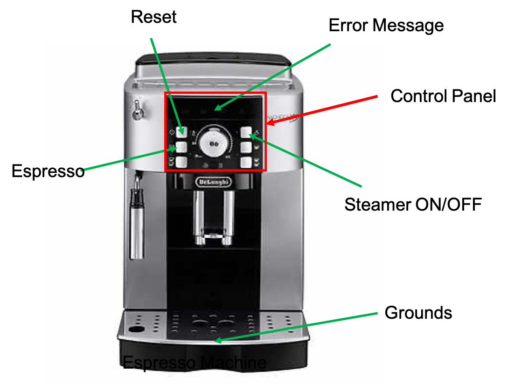

??? note "How to use this example"

    We assume that you have cloned the P repository locally.
    ```shell
    git clone https://github.com/p-org/P.git
    ```

    The recommended way to work through this example is to open the [P/Tutorial](https://github.com/p-org/P/tree/master/Tutorial) folder in IntelliJ side-by-side a browser using which you can simultaneously read the description for each example and browse the P program in IntelliJ.

    To know more about the P language primitives used in the example, please look them up in the [language manual](../manualoutline.md).

We have reached the middle of our tutorials :yawning_face:, it's time to take a break and have an espresso coffee! :coffee:

P has been used in the past to implement device drivers and robotics systems (see [case studies](../casestudies.md) and [publications](../publications.md#p-case-studies)). One of the many challenges in implementing such systems is that they are reactive and hence, must handle arbitrary sequences of events (inputs) appropriately depending on their current mode of operation.

**System:** We consider a fun example of modeling an espresso coffee machine and see how we can use P state machines to model a reactive system that must respond correctly to various user inputs. The user interacts with the coffee machine through its control panel. So the Espresso machine basically consists of two parts: the front-end control panel and the backend coffee maker that actually makes the coffee.

{ width=50% align=center }

The control panel presents an interface to the user to perform operations like `reset` machine, turn `steamer` on and off, request an `espresso`, and clear the `grounds` by opening the container. The control panel interprets these inputs from the user and sends appropriate commands to the coffee maker.

**Correctness Specifications:**
By default, the P checker tests whether any event that is received in a state has a handler defined for it, otherwise, it would result in an unhandled event exception. If the P checker fails to find a bug then it implies that the system model can handle any sequence of events generated by the given environment which in our example's context implies that the coffee machine control panel can appropriately handle any sequence of inputs (button presses) by the user. We would also like to check that the coffee machine moves through a desired sequence of states, i.e., `WarmUp -> Ready -> GrindBeans -> MakeCoffee -> Ready`.

### P Project

The [3_EspressoMachine](https://github.com/p-org/P/tree/master/Tutorial/3_EspressoMachine) folder contains the source code for the [EspressoMachine](https://github.com/p-org/P/blob/master/Tutorial/3_EspressoMachine/EspressoMachine.pproj) project. Please feel free to read details about the recommended [P program structure](../advanced/structureOfPProgram.md) and [P project file](../advanced/PProject.md).

### Models

The P models ([PSrc](https://github.com/p-org/P/tree/master/Tutorial/3_EspressoMachine/PSrc)) for the EspressoMachine example consist of three files:

- [CoffeeMakerControlPanel.p](https://github.com/p-org/P/blob/master/Tutorial/3_EspressoMachine/PSrc/CoffeeMakerControlPanel.p): Implements the CoffeeMakerControlPanel state machine. Basically, the control panel starts in the initial state and kicks off by warming up the coffee maker. After warming is successful, it moves to the ready state where it can either make coffee or start the steamer. When asked to make coffee, it first grinds the beans and then brews coffee. In any of these states, if there is an error due to. e.g, no water or no beans, the control panel informs the user of the error and moves to the error state waiting for the user to reset the machine.

??? tip "[Expand]: Let's walk through CoffeeMakerControlPanel.p"
    - ([L2 - L19](https://github.com/p-org/P/blob/master/Tutorial/3_EspressoMachine/PSrc/CoffeeMakerControlPanel.p#L2-L19))  &rarr; Declare events that are used to communicate between the `User` and the `ControlPanel` machines (manual: [event declaration](../manual/events.md)). These are events that represent the operations performed by the user, e.g., resetting the machine, pressing the steamer button on and off, etc.
    - ([L34 - L231](https://github.com/p-org/P/blob/master/Tutorial/3_EspressoMachine/PSrc/CoffeeMakerControlPanel.p#L34-L231)) &rarr; Declares the `CoffeeMakerControlPanel` state machine. The interesting points that we would like to highlight are: (1) the state machine transitions from one mode (or state) to another based on the events received from the user and the `CoffeeMaker` machine; (2) in all the states, the state machine appropriately handles different events that can be received, including ignoring or deferring them if they are stale events.


- [CoffeeMaker.p](https://github.com/p-org/P/blob/master/Tutorial/3_EspressoMachine/PSrc/CoffeeMaker.p): Implements the CoffeeMaker state machine.

??? tip "[Expand]: Let's walk through CoffeeMaker.p"
    - ([L4 - L29](https://github.com/p-org/P/blob/master/Tutorial/3_EspressoMachine/PSrc/CoffeeMaker.p#L4-L29)) &rarr; Declares the events used to communicate between the control panel and the backend coffee maker.
    - ([L31 - L78](https://github.com/p-org/P/blob/master/Tutorial/3_EspressoMachine/PSrc/CoffeeMaker.p#L31-L78)) &rarr; Declares the `EspressoCoffeeMaker` machine. EspressoCoffeeMaker receives requests from the control panel of the coffee machine and
    based on its state e.g., whether heater is working, or it has beans and water, the coffee maker responds nondeterministically
    back to the controller if the operation succeeded or errored.

- [EspressoMachineModules.p](https://github.com/p-org/P/blob/master/Tutorial/3_EspressoMachine/PSrc/EspressoMachineModules.p): Declares the P module corresponding to EspressoMachine.

### Specifications

The P Specification ([PSpec](https://github.com/p-org/P/tree/master/Tutorial/3_EspressoMachine/PSpec)) for the EspressoMachine example is implemented in [Safety.p](https://github.com/p-org/P/blob/master/Tutorial/3_EspressoMachine/PSpec/Safety.p). We define a safety specification `EspressoMachineModesOfOperation` that observes the internal state of the EspressoMachine through the events that are announced as the system moves through different states and asserts that it always moves through the desired sequence of states. Steady operation: `WarmUp -> Ready -> GrindBeans -> MakeCoffee -> Ready`. If an error occurs in any of the states above then the EspressoMachine stays in the error state until
it is reset and after which it returns to the `Warmup` state.

??? tip "[Expand]: Let's walk through Safety.p"
    - ([L1 - L7](https://github.com/p-org/P/blob/master/Tutorial/3_EspressoMachine/PSpec/Safety.p#L1-L7)) &rarr; Events used to inform the monitor about the state of the EspressoMachine system. The events are announced as the system moves from one state to another (manual: [announce statement](../manual/statements.md#announce)).
    - The `EspressoMachineModesOfOperation` spec machine observes these events and ensures that the system moves through the states defined by the monitor. Note that if the system allows (has execution as) a sequence of events that are not accepted by the monitor (i.e., the monitor throws an unhandled event exception) then the system does not satisfy the desired specification. Hence, this monitor can be thought of accepting only those behaviors of the system that follow the sequence of states modelled by the spec machine. For example, if the system moves from Ready to CoffeeMaking state directly without Grinding then the monitor will raise an ALARM!
    - To understand the semantics of the P spec machines, please read manual: [p monitors](../manual/monitors.md).

### Test Scenarios

The test scenarios folder in P has two parts: TestDrivers and TestScripts. TestDrivers are collections of state machines that implement the test harnesses (or environment state machines) for different test scenarios. TestScripts are collections of test cases that are automatically run by the P checker.

The test scenarios folder for EspressoMachine ([PTst](https://github.com/p-org/P/tree/master/Tutorial/1_EspressoMachine/PTst)) consists of three files: [TestDriver.p](https://github.com/p-org/P/blob/master/Tutorial/3_EspressoMachine/PTst/TestDrivers.p) and [TestScript.p](https://github.com/p-org/P/blob/master/Tutorial/3_EspressoMachine/PTst/TestScripts.p) are just like other previous examples. The [User.p](https://github.com/p-org/P/blob/master/Tutorial/3_EspressoMachine/PTst/Users.p) declares two machines: (1) a [`SaneUser` machine](https://github.com/p-org/P/blob/master/Tutorial/3_EspressoMachine/PTst/Users.p#L4-L51) that uses the EspressoMachine with care, pressing the buttons in the right order, and cleaning up the grounds after the coffee is made; and (2) a [`CrazyUser` machine](https://github.com/p-org/P/blob/master/Tutorial/3_EspressoMachine/PTst/Users.p#L66-L136) who has never used an espresso machine before, gets too excited, and starts pushing random buttons on the control panel.

### Compiling EspressoMachine

Run the following command to compile the  project:

```shell
p compile
```

??? note "Expected Output"
    ```
    $ p compile

    .. Searching for a P project file *.pproj locally in the current folder
    .. Found P project file: P/Tutorial/3_EspressoMachine/EspressoMachine.pproj
    ----------------------------------------
    ==== Loading project file: P/Tutorial/3_EspressoMachine/EspressoMachine.pproj
    ....... includes p file: P/Tutorial/3_EspressoMachine/PSrc/CoffeeMaker.p
    ....... includes p file: P/Tutorial/3_EspressoMachine/PSrc/CoffeeMakerControlPanel.p
    ....... includes p file: P/Tutorial/3_EspressoMachine/PSrc/EspressoMachineModules.p
    ....... includes p file: P/Tutorial/3_EspressoMachine/PSpec/Safety.p
    ....... includes p file: P/Tutorial/3_EspressoMachine/PTst/Users.p
    ....... includes p file: P/Tutorial/3_EspressoMachine/PTst/TestDrivers.p
    ....... includes p file: P/Tutorial/3_EspressoMachine/PTst/TestScripts.p
    ----------------------------------------
    Parsing ...
    Type checking ...
    Code generation ...
    Generated EspressoMachine.cs.
    ----------------------------------------
    Compiling EspressoMachine...
    MSBuild version 17.3.1+2badb37d1 for .NET
    Determining projects to restore...
    Restored P/Tutorial/3_EspressoMachine/PGenerated/CSharp/EspressoMachine.csproj (in 102 ms).
    EspressoMachine -> P/Tutorial/3_EspressoMachine/PGenerated/CSharp/net6.0/EspressoMachine.dll

    Build succeeded.
    0 Warning(s)
    0 Error(s)

    Time Elapsed 00:00:04.57


    ----------------------------------------
    ~~ [PTool]: Thanks for using P! ~~
    ```

### Checking EspressoMachine

You can get the list of test cases defined in the EspressoMachine project by running the P Checker:

```shell
p check
```

??? note "Expected Output"

    ```hl_lines="8 9"
    $ p check

    .. Searching for a P compiled file locally in the current folder
    .. Found a P compiled file: P/Tutorial/3_EspressoMachine/PGenerated/CSharp/net6.0/EspressoMachine.dll
    .. Checking P/Tutorial/3_EspressoMachine/PGenerated/CSharp/net6.0/EspressoMachine.dll
    Error: We found '2' test cases. Please provide a more precise name of the test case you wish to check using (--testcase | -tc).
    Possible options are:
    tcSaneUserUsingCoffeeMachine
    tcCrazyUserUsingCoffeeMachine

    ~~ [PTool]: Thanks for using P! ~~
    ```

There are two test cases defined in the EspressoMachine project and you can specify which
test case to run by using the `-tc` parameter along with the `-s` parameter for the number of schedules to explore.

Check the `tcSaneUserUsingCoffeeMachine` test case for 10,000 schedules:

```shell
p check -tc tcSaneUserUsingCoffeeMachine -s 10000
```

Check the `tcCrazyUserUsingCoffeeMachine` test case for 10,000 schedules:

```shell
p check -tc tcCrazyUserUsingCoffeeMachine -s 10000
```

### Exercise Problem

- [Problem 1] Note that the current safety specification `EspressoMachineModesOfOperation` does not capture the case where the CoffeeMaker can move to CoffeeMakerDoorOpened state. Extend the spec to cover those modes of operations as well.

!!! info "Thinking! ... :thinking::thinking:"
    Can you think of other cases where you would like to check that your system evolves through a certain sequence of states? Or that it allows only those executions which follow a pattern? Can these be specified as P monitors? If not, what are the challenges? A typical example of such cases is when for files in a storage system the sequence of operations that must succeed need to have a pattern of the form: open &rarr; read* &rarr; close; and similarly, for lock services, lockAcquire &rarr; readSuccess &rarr; lockReleased. More interestingly, you can also check things like: AuthenticationSuccess(x) &rarr; ReadSuccess(x), and never see a case of AuthenticationFailure(x) &rarr; ReadSuccess(x) in your executions! What do you think? Post your comments in the [github discussions](https://github.com/p-org/P/discussions).

!!! success "What did we learn through this example?"
    This was a fun example to demonstrate how to model a reactive system using P state machines. We saw how using P monitors allows us to check that the system moves through the correct modes of operation and that the executions only allow certain patterns.
