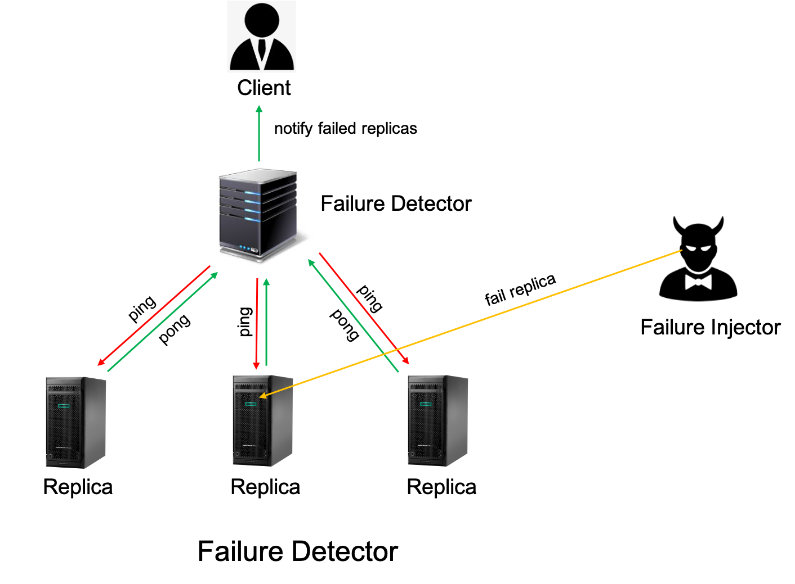

Energized with the Coffee :coffee:, let's get back to modeling distributed systems. After the two phase commit protocol, the next protocol that we will jump to is a simple broadcast-based failure detector!

By this point in the tutorial, we have gotten familiar with the P language and most of its features. So, working through this example should be super fast!

??? note "How to use this example"

    We assume that you have cloned the P repository locally.
    ```shell
    git clone https://github.com/p-org/P.git
    ```

    The recommended way to work through this example is to open the [P/Tutorial](https://github.com/p-org/P/tree/master/Tutorial) folder in IntelliJ side-by-side a browser using which you can simultaneously read the description for each example and browse the P program in IntelliJ.

    To know more about P language primitives used in the example, please look them up in the [language manual](../manualoutline.md).

**System:** We consider a simple failure detector that basically broadcasts ping messages to all the nodes in the system and uses a timer to wait for pong responses from all nodes. If a node does not respond with a pong message after multiple attempts (either because of network failure or node failure), the failure detector marks the node as down and notifies the clients about the nodes that are potentially down. We use this example to show how to model network message loss in P and discuss how to model other types of network behaviours.

{ align=center }

**Correctness Specification:** We would like to check - using a liveness specification - that if the failure injector shuts down a particular node then the failure detector always eventually detects the node failure and notifies the client.

### P Project

The [4_FailureDetector](https://github.com/p-org/P/tree/master/Tutorial/4_FailureDetector) folder contains the source code for the [FailureDetector](https://github.com/p-org/P/blob/master/Tutorial/4_FailureDetector/FailureDetector.pproj) project. Please feel free to read details about the recommended [P program structure](../advanced/structureOfPProgram.md) and [P project file](../advanced/PProject.md).

### Models

The P models ([PSrc](https://github.com/p-org/P/tree/master/Tutorial/4_FailureDetector/PSrc)) for the FailureDetector example consist of four files:

- [FailureDetector.p](https://github.com/p-org/P/blob/master/Tutorial/4_FailureDetector/PSrc/FailureDetector.p): Implements the `FailureDetector` machine.

??? tip "[Expand]: Let's walk through FailureDetector.p"

    - ([L1 - L4](https://github.com/p-org/P/blob/master/Tutorial/4_FailureDetector/PSrc/FailureDetector.p#L1-L4))  &rarr; Event `ePing` and `ePong` are used to communicate between the `FailureDetector` and the `Node` state machines (manual: [event declaration](../manual/events.md)).
    - ([L6](https://github.com/p-org/P/blob/master/Tutorial/4_FailureDetector/PSrc/FailureDetector.p#L6)) &rarr; Event `eNotifyNodesDown` is used by the FailureDetector to inform the clients about the nodes that are potentially down.
    - ([L14 - L129](https://github.com/p-org/P/blob/master/Tutorial/4_FailureDetector/PSrc/FailureDetector.p#L14-L129))  &rarr; Declares the `FailureDetector` state machine (manual: [P state machine](../manual/statemachines.md)). The key points to note in the `FailureDetector` machine are the usage of the [Timer](https://github.com/p-org/P/tree/master/Tutorial/Common/Timer) machine to model the usage of OS timer, the usage of [ReliableBroadCast](https://github.com/p-org/P/blob/master/Tutorial/4_FailureDetector/PSrc/FailureDetector.p#L81), and the usage of [UnReliableBroadCast](https://github.com/p-org/P/blob/master/Tutorial/4_FailureDetector/PSrc/FailureDetector.p#L48) defined in [NetworkFunctions.p](https://github.com/p-org/P/blob/master/Tutorial/Common/FailureInjector/PSrc/NetworkFunctions.p).

- [Node.p](https://github.com/p-org/P/blob/master/Tutorial/4_FailureDetector/PSrc/Node.p): Implements the `Node` machine.

??? tip "[Expand]: Let's walk through Node.p"
    - ([L4 - L14](https://github.com/p-org/P/blob/master/Tutorial/4_FailureDetector/PSrc/Node.p#L4-L14)) &rarr; Declares the `Node` state machine. The `Node` machine responds with a `ePong` message on receiving a `ePing` message from the `FailureDetector`. On receiving a `eShutDown` message from the `FailureInjector`, the machine halts itself.

- [Client.p](https://github.com/p-org/P/blob/master/Tutorial/4_FailureDetector/PSrc/Client.p): Declares the `Client` machine.

??? tip "[Expand]: Let's walk through  Client.p"
    The `Client` machine is a dummy machine that gets a set of alive nodes when the system starts and maintains the set of currently alive nodes by removing the nodes that are marked as down by the `FailureDetector`.

- [FailureDetectorModules.p](https://github.com/p-org/P/blob/master/Tutorial/4_FailureDetector/PSrc/FailureDetectorModules.p): Declares the `FailureDetector` module.

??? tip "[Expand]: Let's walk through FailureDetectorModules.p"
    Declares the `FailureDetector` module which is the union of the module consisting of the `FailureDetector`, `Node`, and `Client` machines and the `Timer` module.


### Specifications

The P Specification ([PSpec](https://github.com/p-org/P/tree/master/Tutorial/4_FailureDetector/PSpec)) for the FailureDetector is implemented in [ReliableFailureDetector.p](https://github.com/p-org/P/blob/master/Tutorial/4_FailureDetector/PSpec/ReliableFailureDetector.p). We define a simple `ReliableFailureDetector` liveness specification to assert that all nodes that have been shutdown
by the failure injector will eventually be detected by the failure detector as failed nodes.

??? tip "[Expand]: Let's walk through ReliableFailureDetector.p"
    - ([L6 - L57](https://github.com/p-org/P/blob/master/Tutorial/4_FailureDetector/PSpec/ReliableFailureDetector.p#L6-L57)) &rarr; Declares the `ReliableFailureDetector` liveness monitor. `ReliableFailureDetector` spec machine basically maintains two sets `nodesDownDetected` (nodes that are detected as down by the detector) and `nodesShutdownAndNotDetected` (nodes that are shutdown by the failure injector but not yet detected). `ReliableFailureDetector` monitor observes the `eNotifyNodesDown` and `eShutDown` events to update these maps and move between the `hot` state (unstable state) and non-hot states. The system is in a hot state if there are nodes that are shutdown but not yet detected by the failure detector. The system violates a liveness specification if any of its execution paths terminates in a hot state.
    - To understand the semantics of the P spec machines and the details about liveness monitors, please read the manual: [p monitors](../manual/monitors.md).

### Test Scenarios

The test scenarios folder in P has two parts: TestDrivers and TestScripts. TestDrivers are collections of state machines that implement the test harnesses (or environment state machines) for different test scenarios. TestScripts are collections of test cases that are automatically run by the P checker.

The test scenarios folder for FailureDetector ([PTst](https://github.com/p-org/P/tree/master/Tutorial/4_FailureDetector/PTst)) consists of two files [TestDriver.p](https://github.com/p-org/P/blob/master/Tutorial/4_FailureDetector/PTst/TestDriver.p) and [TestScript.p](https://github.com/p-org/P/blob/master/Tutorial/4_FailureDetector/PTst/TestScript.p).

??? tip "[Expand]: Let's walk through TestDriver.p"
    This file consists of a single test driver machine that sets up the system under test given the number of nodes and clients in the system. The [`SetupSystemWithFailureInjector`](https://github.com/p-org/P/blob/master/Tutorial/4_FailureDetector/PTst/TestDriver.p#L20-L42) function creates the clients, nodes, failure injector and the failure detector machines.

??? tip "[Expand]: Let's walk through TestScript.p"
    There is a single testcase ([TestFailureDetector](https://github.com/p-org/P/blob/master/Tutorial/4_FailureDetector/PTst/TestScript.p#L1-L3)) defined for the FailureDetector system. The test case asserts the `ReliableFailureDetector` specification on a system which is a composition of the `FailureDetector`, `FailureInjector`, and the test-driver `TestMultipleClients`.

### Compiling FailureDetector

Run the following command to compile the FailureDetector project:

```shell
p compile
```

??? note "Expected Output"
    ```
    $ p compile

    .. Searching for a P project file *.pproj locally in the current folder
    .. Found P project file: P/Tutorial/4_FailureDetector/FailureDetector.pproj
    ----------------------------------------
    ==== Loading project file: P/Tutorial/4_FailureDetector/FailureDetector.pproj
    ....... includes p file: P/Tutorial/4_FailureDetector/PSrc/FailureDetectorModules.p
    ....... includes p file: P/Tutorial/4_FailureDetector/PSrc/Client.p
    ....... includes p file: P/Tutorial/4_FailureDetector/PSrc/FailureDetector.p
    ....... includes p file: P/Tutorial/4_FailureDetector/PSrc/Node.p
    ....... includes p file: P/Tutorial/4_FailureDetector/PSpec/ReliableFailureDetector.p
    ....... includes p file: P/Tutorial/4_FailureDetector/PTst/TestDriver.p
    ....... includes p file: P/Tutorial/4_FailureDetector/PTst/TestScript.p
    ==== Loading project file: P/Tutorial/Common/Timer/Timer.pproj
    ....... includes p file: P/Tutorial/Common/Timer/PSrc/Timer.p
    ....... includes p file: P/Tutorial/Common/Timer/PSrc/TimerModules.p
    ==== Loading project file: P/Tutorial/Common/FailureInjector/FailureInjector.pproj
    ....... includes p file: P/Tutorial/Common/FailureInjector/PSrc/NetworkFunctions.p
    ....... includes p file: P/Tutorial/Common/FailureInjector/PSrc/FailureInjector.p
    ----------------------------------------
    Parsing ...
    Type checking ...
    Code generation ...
    Generated FailureDetector.cs.
    ----------------------------------------
    Compiling FailureDetector...
    MSBuild version 17.3.1+2badb37d1 for .NET
    Determining projects to restore...
    Restored P/Tutorial/4_FailureDetector/PGenerated/CSharp/FailureDetector.csproj (in 93 ms).
    FailureDetector -> P/Tutorial/4_FailureDetector/PGenerated/CSharp/net6.0/FailureDetector.dll

    Build succeeded.
    0 Warning(s)
    0 Error(s)

    Time Elapsed 00:00:04.42


    ----------------------------------------
    ~~ [PTool]: Thanks for using P! ~~
    ```

### Checking FailureDetector

There is only a single test case in the FailureDetector project and we can directly run the test case for 10,000 schedules:

```shell
p check -s 10000
```

### Discussion: Modeling Message Reordering

(to be added soon)

### Exercise Problem

!!! success "What did we learn through this example?"
    In this example, we saw how to use data nondeterminism to model message loss and unreliable sends. We also discussed how to model other types of network nondeterminism.

