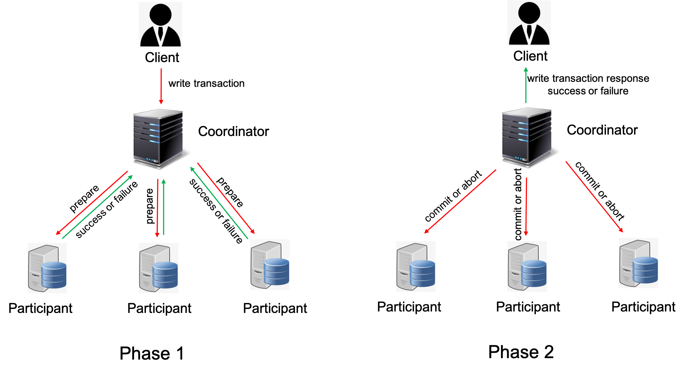

??? note "How to use this example"

    We assume that you have cloned the P repository locally.
    ```shell
    git clone https://github.com/p-org/P.git
    ```

    The recommended way to work through this example is to open the [P/Tutorial](https://github.com/p-org/P/tree/master/Tutorial) folder in IntelliJ side-by-side a browser using which you can simultaneously read the description for each example and browse the P program in IntelliJ.

    To know more about the P language primitives used in this example, please look them up in the [language manual](../manualoutline.md).

Now that we understand the basic features of the P language, let's look at the modeling and analysis of a distributed system :man_juggling:!


**System:** We use a simplified version of the [classic two phase commit protocol](https://s2.smu.edu/~mhd/8330f11/p133-gray.pdf) to model a transaction commit service. The two phase commit protocol uses a coordinator to gain consensus for any transaction spanning across multiple participants. A transaction in our case is simply a `write` operation for a key-value data store where the data store is replicated across multiple participants. More concretely, a `write` transaction must be committed by the coordinator only if it's accepted by all the participant replicas, and must be aborted if any one of the participant replicas rejects the `write` request.

{ align=center }

A two phase commit protocol consists of two phases :laughing: (figure above). On receiving a write transaction, the coordinator starts the first phase in which it sends a `prepare` request to all the participants and waits for a `prepare success` or `prepare failure` response. On receiving prepare responses from all the participants, the coordinator moves to the second phase where it sends a `commit` or `abort` message to the participants and also responds back to the client.

**Assumptions:** Our transaction commit system is ridiculously simplified. To list a few: (1) our system does allow multiple concurrent clients to issue transactions in parallel, but the coordinator serializes these transactions and services them one-by-one; (2) our system is not fault-tolerant to node failures, failure of either the coordinator or any of the participants will block the progress forever. Also, we rely on [P's reliable send semantics](../advanced/psemantics.md) to model the behavior of the underlying network, hence, our system models assume reliable delivery of messages.

**Correctness Specification:** We would like our transaction commit service to provide atomicity guarantees for each transaction. That is, if the service responds to the client that a transaction was committed then that transaction must have been committed by each of its participants; and, if a transaction is aborted then at least one of the participants must have rejected it. We would also like to check that under the assumptions above (no node failures and reliable network), each transaction request is eventually responded by the transaction commit service.

### P Project

The [2_TwoPhaseCommit](https://github.com/p-org/P/tree/master/Tutorial/2_TwoPhaseCommit) folder contains the source code for the [TwoPhaseCommit](https://github.com/p-org/P/blob/master/Tutorial/2_TwoPhaseCommit/TwoPhaseCommit.pproj) project.
Please feel free to read details about the recommended [P program structure](../advanced/structureOfPProgram.md) and [P project file](../advanced/PProject.md).

### Models

The P models ([PSrc](https://github.com/p-org/P/tree/master/Tutorial/2_TwoPhaseCommit/PSrc)) for the TwoPhaseCommit example consists of three files:

- [Coordinator.p](https://github.com/p-org/P/blob/master/Tutorial/2_TwoPhaseCommit/PSrc/Coordinator.p): Implements the Coordinator state machine.

??? tip "[Expand]: Let's walk through Coordinator.p"
    - ([L25 - L33](https://github.com/p-org/P/blob/master/Tutorial/2_TwoPhaseCommit/PSrc/Coordinator.p#L25-L33)) &rarr; Declares the `write` and `read` transaction events used to communicate between the coordinator and the client machines (manual: [event declaration](../manual/events.md)).
    - ([L35 - L43](https://github.com/p-org/P/blob/master/Tutorial/2_TwoPhaseCommit/PSrc/Coordinator.p#L35-L43)) &rarr; Declares the `prepare`, `commit`, and `abort` events used to communicate between the coordinator and the participants in the system.
    - ([L3 - L16](https://github.com/p-org/P/blob/master/Tutorial/2_TwoPhaseCommit/PSrc/Coordinator.p#L3-L16)) &rarr; Declares the payload types associated with these events (manual: [user defined type](../manual/datatypes.md#user-defined)).
    - ([L65 - L177](https://github.com/p-org/P/blob/master/Tutorial/2_TwoPhaseCommit/PSrc/Coordinator.p#L65-L177)) &rarr; Declares the `Coordinator` state machine. The Coordinator machine receives write and read transactions from the clients. The coordinator machine
    services these transactions one by one in the order in which they were received. On receiving a write
    transaction, the coordinator sends a prepare request to all the participants and waits for prepare
    responses from all the participants. Based on the responses, the coordinator either commits or aborts
    the transaction. If the coordinator fails to receive agreement from the participants in time, then it
    times out and aborts the transaction. On receiving a read transaction, the coordinator randomly selects
    a participant and forwards the read request to that participant.
- [Participant.p](https://github.com/p-org/P/blob/master/Tutorial/2_TwoPhaseCommit/PSrc/Participant.p): Implements the Participant state machine.

??? tip "[Expand]: Let's walk through Participant.p"
    - Unlike the `Coordinator` state machine that has multiple states, the `Participant` state machine is fairly simple. Each participant waits for requests from the `Coordinator` and sends the response back based on whether the request can be accepted or has to be rejected.
    - On receiving an `eShutDown` event, the participant executes a `raise halt` to destroy itself. To know more about the special `halt` event, please check the manual: [halt event](../manual/expressions.md#primitive).
    - Each participant maintains a local key-value store which is updated based on the transactions committed by the coordinator. On receiving a prepare request from the coordinator, the participant chooses to either accept or reject the transaction based on the associated transaction id.

- [TwoPhaseCommitModules.p](https://github.com/p-org/P/blob/master/Tutorial/2_TwoPhaseCommit/PSrc/TwoPhaseCommitModules.p): Declares the P module corresponding to the two phase commit system.

### Timer and Failure Injector

Our two phase commit project depends on two other components:

- **OS Timer:** The coordinator machine uses a timer to wait for prepare responses from all participants. The `OS timer` is modeled in P using the [`Timer` machine](https://github.com/p-org/P/blob/master/Tutorial/Common/Timer/PSrc/Timer.p) declared in the [`Timer project`](https://github.com/p-org/P/tree/master/Tutorial/Common/Timer). The Timer model demonstrates how when reasoning about the correctness of a system, we need to also model its interaction with any nondeterministic environment or service (in this case, an OS timer).

- **Failure Injector:** P allows programmers to explicitly model different types of failures in the system. The [`FailureInjector`](https://github.com/p-org/P/tree/master/Tutorial/Common/FailureInjector) project demonstrates how to model node failures in P using the `halt` event. The [`FailureInjector` machine](https://github.com/p-org/P/blob/master/Tutorial/Common/FailureInjector/PSrc/FailureInjector.p) nondeterministically picks a node and sends a `eShutDown` event. On receiving an `eShutDown` event, the corresponding node must `halt` to destroy itself. To know more about the special `halt` event, please check the manual: [halt event](../manual/expressions.md#primitive).

### Specifications

The P Specifications ([PSpec](https://github.com/p-org/P/blob/master/Tutorial/2_TwoPhaseCommit/PSpec)) for the TwoPhaseCommit example are implemented in the [Atomicity.p](https://github.com/p-org/P/blob/master/Tutorial/2_TwoPhaseCommit/PSpec/Atomicity.p) file. We define two specifications:

- **Atomicity** (safety property): if a transaction is committed by the coordinator then it was agreed on by all participants, and if the transaction is aborted then at least one participant must have rejected the transaction.

- **Progress** (liveness property): every received transaction must be eventually responded (in the absence of node failures).

!!! info "Weaker Property"
    Note that we have asserted a weaker property than what is required for Atomicity. Ideally, we would like to check that if a transaction is committed by the coordinator then it was committed-locally by all participants, and if the transaction is aborted then at least one participant must have rejected the transaction and all the participants aborted the transaction. We leave implementing this stronger property as an exercise problem, which you can revisit after finishing the other problems in the tutorials.

### Test Scenarios

The test scenarios folder in P has two parts: TestDrivers and TestScripts. TestDrivers are collections of state machines that implement the test harnesses (or environment state machines) for different test scenarios. TestScripts are collections of test cases that are automatically run by the P checker.

The test scenarios folder for TwoPhaseCommit ([PTst](https://github.com/p-org/P/tree/master/Tutorial/2_TwoPhaseCommit/PTst)) consists of three files [TestDriver.p](https://github.com/p-org/P/blob/master/Tutorial/2_TwoPhaseCommit/PTst/TestDriver.p), [TestScript.p](https://github.com/p-org/P/blob/master/Tutorial/2_TwoPhaseCommit/PTst/TestScripts.p) and [Client.p](https://github.com/p-org/P/blob/master/Tutorial/2_TwoPhaseCommit/PTst/Client.p).

??? tip "[Expand]: Let's walk through TestDriver.p"
    - ([L9 - L42](https://github.com/p-org/P/blob/master/Tutorial/2_TwoPhaseCommit/PTst/TestDriver.p#L9-L42)) &rarr; Function `SetUpTwoPhaseCommitSystem` takes as input `t2PCConfig` that specifies the number of clients, participants, etc. to be created and sets up the system by creating the machines. The function also initializes the spec monitors by informing them about the number of participants in the system before the system starts executing [here](https://github.com/p-org/P/blob/master/Tutorial/2_TwoPhaseCommit/PTst/TestDriver.p#L23-L24).
    - ([L3 - L22](https://github.com/p-org/P/blob/master/Tutorial/2_TwoPhaseCommit/PTst/TestDriver.p#L50-L101)) &rarr; Machines `SingleClientNoFailure`, `MultipleClientsNoFailure` and `MultipleClientsWithFailure` are simple test driver machines that configure the system to be checked by the P checker for different scenarios.

??? tip "[Expand]: Let's walk through TestScript.p"
    P allows programmers to write different test cases. Each test case is checked separately and can use a different test driver. Using different test drivers triggers different behaviors in the system under test, as it implies different system configurations and input generators. To better understand the P test cases, please look at manual: [P test cases](../manual/testcases.md).

    - ([L1 - L12](https://github.com/p-org/P/blob/master/Tutorial/2_TwoPhaseCommit/PTst/TestScripts.p#L1-L12)) &rarr; Declares three test cases each checking a different scenario in the system. The system under test is the `union` of the modules representing each component in the system (manual: [P module system](../manual/modulesystem.md#union-module)). The `assert` module constructor is used to attach monitors or specifications to be checked on the modules (manual: [assert](../manual/modulesystem.md#assert-monitors-module)).

??? tip "[Expand]: Let's walk through Client.p"
    The `Client` machine implements the client of the two-phase-commit transaction service. Each client issues N non-deterministic write-transactions, if the transaction succeeds then it performs a read-transaction on the same key and asserts that the value read is same as what was written by the write transaction.

    - ([L60](https://github.com/p-org/P/blob/master/Tutorial/2_TwoPhaseCommit/PTst/Client.p#L60)) &rarr; Declares a foreign function in P. Foreign functions are functions that are declared in P but implemented in the external foreign language. Please read the example in [P foreign interface](../manual/foriegntypesfunctions.md) to know more about this functionality. In this example, the `ChooseRandomTransaction` function could have been very easily written in P itself but it's implemented as foreign function just to demonstrate that P supports this functionality.

### Compiling TwoPhaseCommit

Navigate to the [2_TwoPhaseCommit](https://github.com/p-org/P/tree/master/Tutorial/2_TwoPhaseCommit) folder and run the following command to compile the TwoPhaseCommit project:

```shell
p compile
```

??? note "Expected Output"
    ```
    $ p compile

    .. Searching for a P project file *.pproj locally in the current folder
    .. Found P project file: P/Tutorial/2_TwoPhaseCommit/TwoPhaseCommit.pproj
    ----------------------------------------
    ==== Loading project file: P/Tutorial/2_TwoPhaseCommit/TwoPhaseCommit.pproj
    ....... includes p file: P/Tutorial/2_TwoPhaseCommit/PSrc/Coordinator.p
    ....... includes p file: P/Tutorial/2_TwoPhaseCommit/PSrc/Participant.p
    ....... includes p file: P/Tutorial/2_TwoPhaseCommit/PSrc/TwoPhaseCommitModules.p
    ....... includes p file: P/Tutorial/2_TwoPhaseCommit/PSpec/Atomicity.p
    ....... includes p file: P/Tutorial/2_TwoPhaseCommit/PTst/TestDriver.p
    ....... includes p file: P/Tutorial/2_TwoPhaseCommit/PTst/Client.p
    ....... includes p file: P/Tutorial/2_TwoPhaseCommit/PTst/TestScripts.p
    ....... includes foreign file: P/Tutorial/2_TwoPhaseCommit/PForeign/ForeignCode.cs
    ==== Loading project file: P/Tutorial/Common/Timer/Timer.pproj
    ....... includes p file: P/Tutorial/Common/Timer/PSrc/Timer.p
    ....... includes p file: P/Tutorial/Common/Timer/PSrc/TimerModules.p
    ==== Loading project file: P/Tutorial/Common/FailureInjector/FailureInjector.pproj
    ....... includes p file: P/Tutorial/Common/FailureInjector/PSrc/NetworkFunctions.p
    ....... includes p file: P/Tutorial/Common/FailureInjector/PSrc/FailureInjector.p
    ----------------------------------------
    Parsing ...
    Type checking ...
    Code generation ...
    Generated TwoPhaseCommit.cs.
    ----------------------------------------
    Compiling TwoPhaseCommit...
    MSBuild version 17.3.1+2badb37d1 for .NET
    Determining projects to restore...
    Restored P/Tutorial/2_TwoPhaseCommit/PGenerated/CSharp/TwoPhaseCommit.csproj (in 92 ms).
    TwoPhaseCommit -> P/Tutorial/2_TwoPhaseCommit/PGenerated/CSharp/net6.0/TwoPhaseCommit.dll

    Build succeeded.
    0 Warning(s)
    0 Error(s)

    Time Elapsed 00:00:04.65


    ----------------------------------------
    ~~ [PTool]: Thanks for using P! ~~
    ```

### Checking TwoPhaseCommit

You can get the list of test cases defined in the TwoPhaseCommit project by running the P Checker:

```shell
p check
```

??? note "Expected Output"

    ```hl_lines="8 9 10"
    $ p check

    .. Searching for a P compiled file locally in the current folder
    .. Found a P compiled file: P/Tutorial/2_TwoPhaseCommit/PGenerated/CSharp/net6.0/TwoPhaseCommit.dll
    .. Checking P/Tutorial/2_TwoPhaseCommit/PGenerated/CSharp/net6.0/TwoPhaseCommit.dll
    Error: We found '3' test cases. Please provide a more precise name of the test case you wish to check using (--testcase | -tc).
    Possible options are:
    tcSingleClientNoFailure
    tcMultipleClientsNoFailure
    tcMultipleClientsWithFailure

    ~~ [PTool]: Thanks for using P! ~~
    ```

There are three test cases defined in the TwoPhaseCommit project and you can specify which
test case to run by using the `-tc` parameter along with the `-s` parameter for the number of schedules to explore.

Check the `tcSingleClientNoFailure` test case for 10,000 schedules:

```shell
p check -tc tcSingleClientNoFailure -s 10000
```

Check the `tcMultipleClientsNoFailure` test case for 10,000 schedules:

```
p check -tc tcMultipleClientsNoFailure -s 10000
```
!!! danger "Error"
    `tcMultipleClientsNoFailure` triggers a very subtle concurrency bug in the assumption made by the client of the two phase commit protocol.

    `<ErrorLog> Assertion Failed: PTst/Client.p:42:13 Record read is not same as what was written by the client:: read - X, written - Y`

    Please use the [guide](../advanced/debuggingerror.md) to explore how to debug an error trace generated by P Checker.

!!! hint "Hint"

    If you dive deeper in the log, you would notice that the error happens when two clients write to the same key. There is a race between the two clients issuing a write and read transaction on the same key with different values. The fix for this problem is to update the assertion on the client side to: if the value that is read when confirming the transaction is not the same as the value that was written then it must have been overridden by a transaction with id greater than its transaction id. **This is true because Participants accept transaction to the same key in the monotonically increasing transaction ids**.

Check the `tcMultipleClientsWithFailure` test case for 10,000 schedules:

```shell
p check -tc tcMultipleClientsWithFailure -s 10000
```

!!! danger "Error"
    `tcMultipleClientsWithFailure` demonstrates the known case where in the presence of node failures the two phase commit protocol does not guarantee progress.

    `<ErrorLog> Deadlock detected. Client(7) is waiting to receive an event, but no other controlled tasks are enabled.`

    Please use the [guide](../advanced/debuggingerror.md) to explore how to debug an error trace generated by P Checker.

    If you comment out the part of the Client state machine code that performs the read transaction then you would see that the Progress liveness monitor starts complaining.


### Exercise Problem

- [Problem 1] Based on the hint above, try and fix the concurrency bug in the `Client` state machine and run the test cases again!

- [Problem 2] A really interesting exploratory problem would be to try and combine the two phase commit protocol with the failure detector system to overcome the progress issue faced by the two phase commit protocol in the presence of node failures. Can you really do that? Let's have a discussion and build a variant of the protocol to tolerate failures?

!!! summary "What did we learn through this example?"
    We dived deeper into: (1) modeling non-determinism in distributed systems, in particular, time-outs; (2) writing complex safety properties like atomicity of transactions in P; and finally, (3) modeling node failures in P using a failure injector state machine. We will also show how P allows invoking foreign code from the P programs. More details in [P foreign interface](../manual/foriegntypesfunctions.md).
