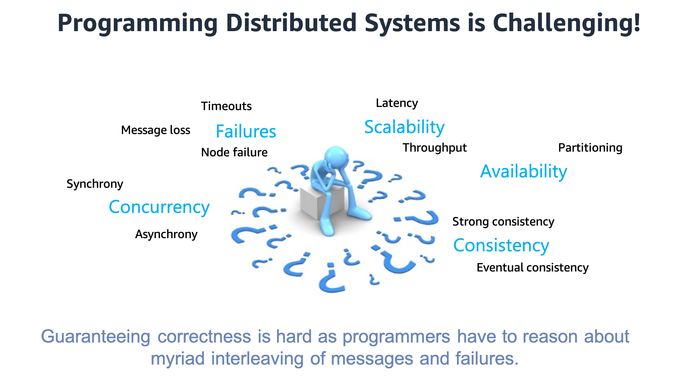
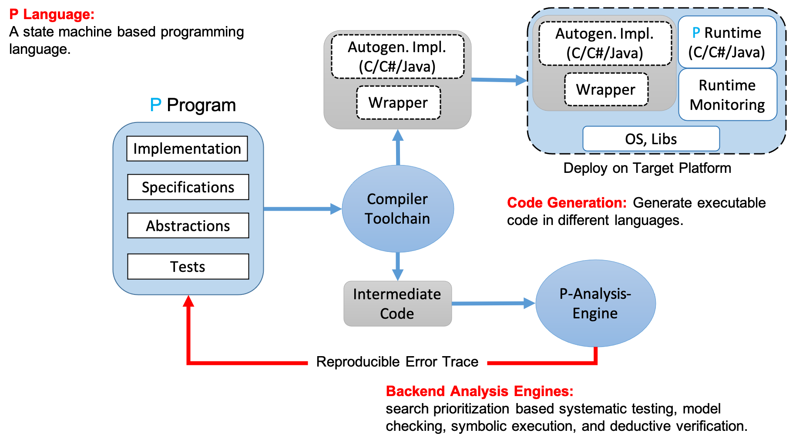

{ align=center }

Distributed systems are notoriously hard to get right (i.e., guaranteeing correctness) as the
programmer needs to reason about numerous control paths resulting from the myriad
interleaving of events (or messages or failures). Unsurprisingly, programmers can easily
introduce subtle errors when designing these systems. Moreover, it is extremely
difficult to test distributed systems, as most control paths remain untested, and serious
bugs lie dormant for months or even years after deployment.

!!! info ""
    _The P programming framework takes several steps towards addressing these challenges by providing
    a unified framework for modeling, specifying, implementing, testing, and verifying complex
    distributed systems._

### P Framework

{ align=center }

The P framework can be divided into **three** important parts:

#### P Language

P provides a high-level **state machine based programming language** to formally model and specify
distributed systems. The syntactic sugar of state machines allows programmers to capture
their system design (or _protocol logic_) as communicating state machines, which is how programmers generally
think about their system's design. P is more of a programming language than a mathematical
modelling language and hence, making it easier for the programmers to both: (1) create formal models that are closer
to the implementation (sufficiently detailed) and also (2) maintain these models as the system design evolves.
P supports specifying and checking both safety as well as liveness specifications (global invariants).
Programmers can easily write different scenarios under which they would like to check that the system satisfies the desired correctness specification.
The P module system enables programmers to model their system _modularly_ and
perform _compositional_ testing to scale the analysis to large distributed systems.

!!! Tip "Models, Specifications, Model Checking Scenario"
    A quick primer on what a model
    is, versus a specification, and model checking scenarios: (1) a specification says what
    the system should do (correctness properties); (2) a model captures the details of how the
    system does it; (3) a model checking scenario provides the finite non-deterministc
    test-harness or environment under which the model checker should check that the system
    model satisfies its specifications.

The underlying model of computation for P programs is communicating state machines (or [actors](https://en.wikipedia.org/wiki/Actor_model)). The detailed formal semantics for P can be found [here](https://ankushdesai.github.io/assets/papers/modp.pdf) and an informal discussion [here](advanced/psemantics.md).

#### Backend Analysis Engines

P provides a backend analysis engine to systematically explore behaviors of the system model (_resulting from interleaving of messages and failures_) and check that the model satisfies the desired _correctness_ specifications.
To reason about complex distributed systems, the P checker needs to tackle the well-known problem of _state space explosion_. The P checker employs [search prioritization heuristics](https://ankushdesai.github.io/assets/papers/fse-desai.pdf) to drive the exploration along different parts of the state space that are most likely to have concurrency related issues. The P checker is really **efficient at uncovering deep bugs** (i.e., bugs that require complex interleaving of events) in the system design that have a really low probability of occurrence in real-world. On finding a bug, the checker provides a reproducible error-trace which the programmer can use for debugging.

Although the current P checker is great at finding _deep-hard-to-find_ bugs ("[Heisenbugs](https://en.wikipedia.org/wiki/Heisenbug)"), it **cannot provide a proof** of correctness.
We are actively working on addressing this challenge and are building two new backends for P. First, a _symbolic execution engine_ that can scale the P checker to models of large
distributed systems and provide **sound guarantees** of exploring all possible behaviors. Second, a deductive verification engine to perform **mathematical proof** of correctness for P programs. Both these backends will be released publicly soon.

[^1]: They are currently maintained in the dev branch `symbolic-codegen`.

#### Code Generation

The P compiler currently generates C# and C code. The generated code when combined with the P Runtime (that executes the P state machines) can be deployed on any target platform.
The generated C code has been used to program [device drivers](https://ankushdesai.github.io/assets/papers/p.pdf) and [robotics systems](https://ankushdesai.github.io/assets/papers/drona.pdf). The generated C# code has been used to program [distributed systems](https://ankushdesai.github.io/assets/papers/modp.pdf).

We are currently working on adding support for a Java backend for P. We will also be adding support for generating _runtime monitors_ for specifications that can be then used to check if the implementation conforms to the high-level P specifications.
