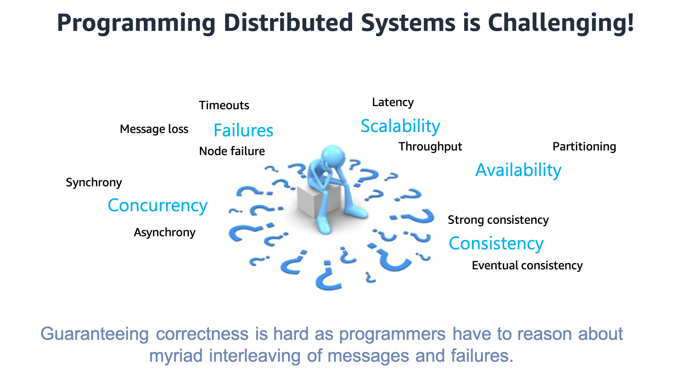
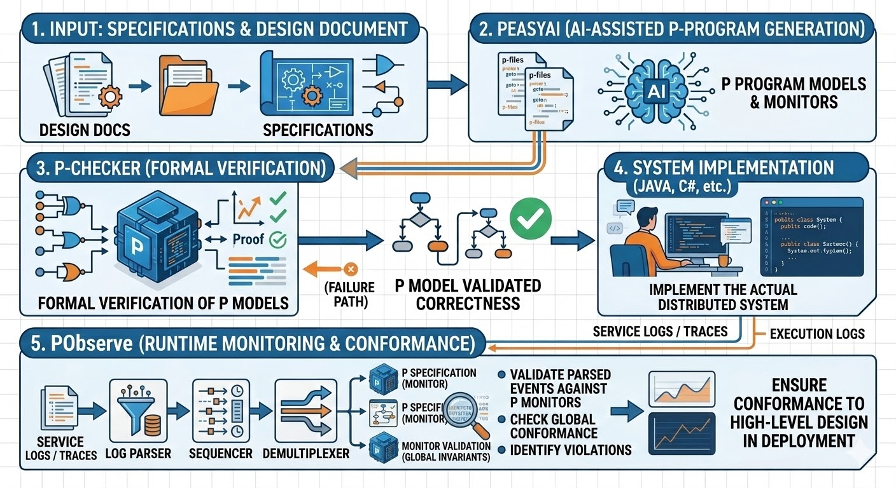

# What is P?

{ align=center }

Distributed systems are notoriously hard to get right. Programmers must reason about numerous control paths resulting from the myriad interleaving of events, messages, and failures. Subtle errors creep in easily, most control paths remain untested, and serious bugs can lie dormant for months or even years after deployment.

!!! abstract "The P Approach"
    The P programming framework addresses these challenges by providing a **unified framework** for modeling, specifying, testing, verifying, and monitoring complex distributed systems — from design all the way through production.

---

## The P Framework

{ align=center }

The P framework provides an end-to-end pipeline for formally modeling, verifying, and monitoring distributed systems. The key components are:

---

### :material-file-document-edit-outline:{ .lg } 1. P Language — Specifications & Design

The process begins with a high-level **design document** describing the distributed system's protocol logic, along with **correctness specifications** (safety and liveness properties) that the system must satisfy.

P provides a high-level **state machine based programming language** to formally model and specify distributed systems. Programmers capture their system design as _communicating state machines_ — which is how developers generally think about protocol logic. P is more of a programming language than a mathematical modelling language, making it easier to:

- :octicons-check-16: Create formal models that are **close to the implementation** (sufficiently detailed)
- :octicons-check-16: **Maintain models** as the system design evolves
- :octicons-check-16: Specify and check both **safety** and **liveness** specifications (global invariants)

??? tip "Models, Specifications, and Model Checking Scenarios"
    A quick primer:

    - **Specification** — says _what_ the system should do (correctness properties)
    - **Model** — captures the details of _how_ the system does it
    - **Model checking scenario** — provides the finite non-deterministic test-harness under which the model checker verifies that the model satisfies its specifications

The underlying model of computation is communicating state machines (or [actors](https://en.wikipedia.org/wiki/Actor_model)). See the [formal semantics paper](https://ankushdesai.github.io/assets/papers/modp.pdf) or the [informal semantics overview](advanced/psemantics.md) for details.

---

### :material-robot-outline:{ .lg } 2. PeasyAI — AI-Assisted Code Generation

[**PeasyAI**](getstarted/peasyai.md) accelerates P development by automatically generating P program models and specification monitors from design documents.

-   :material-code-braces:{ .lg .middle } **Generation**

    ---

    Generates types, state machines, safety specs, and test drivers from plain-text design documents using ensemble generation (best-of-N candidate selection)

-   :material-tools:{ .lg .middle } **Auto-Fix Pipeline**

    ---

    Iteratively resolves compilation errors and PChecker failures, with human-in-the-loop fallback when automated fixing is insufficient

-   :material-database-search:{ .lg .middle } **RAG-Enhanced**

    ---

    1,200+ indexed P code examples improve generation quality through retrieval-augmented generation

-   :material-connection:{ .lg .middle } **IDE Integration**

    ---

    Integrates with **Cursor** and **Claude Code** via MCP, providing 27 tools and 14 resources

---

### :material-shield-check-outline:{ .lg } 3. P-Checker — Formal Verification

P provides backend analysis engines to systematically explore behaviors of the system model — resulting from interleaving of messages and failures — and check that the model satisfies the desired correctness specifications.

!!! success "Finding Deep Bugs"
    The P checker employs [search prioritization heuristics](https://ankushdesai.github.io/assets/papers/fse-desai.pdf) to efficiently uncover **deep bugs** — bugs that require complex interleaving of events and have a very low probability of occurrence in real-world testing. On finding a bug, the checker provides a **reproducible error-trace** for debugging. Once all checks pass, the P model is validated for correctness.

Beyond the default checker, P provides additional analysis backends:

| Engine | Approach | Guarantee |
|--------|----------|-----------|
| [**PSym**](advanced/psym/whatisPSym.md) | Symbolic execution | Sound exploration of all possible behaviors |
| [**PEx**](advanced/pex.md) | Exhaustive model checking | Complete state space coverage |
| [**PVerifier**](advanced/PVerifierLanguageExtensions/announcement.md) | Deductive verification | Mathematical proof of correctness |

---

### :material-monitor-eye:{ .lg } 4. PObserve — Runtime Monitoring & Conformance

[**PObserve**](advanced/pobserve/pobserve.md) bridges the gap between design-time verification and runtime behavior. It validates **service logs and execution traces** from the running system against the same P specification monitors that were verified during formal verification.

-   :material-text-search:{ .lg .middle } **Log Parsing**

    ---

    Parses service logs and sequences events without requiring additional instrumentation

-   :material-check-decagram:{ .lg .middle } **Conformance Checking**

    ---

    Feeds events through P specification monitors to check global conformance and identify violations

!!! info ""
    PObserve ensures that the **implementation conforms to the high-level design in deployment** — extending formal verification guarantees from design time into production.
