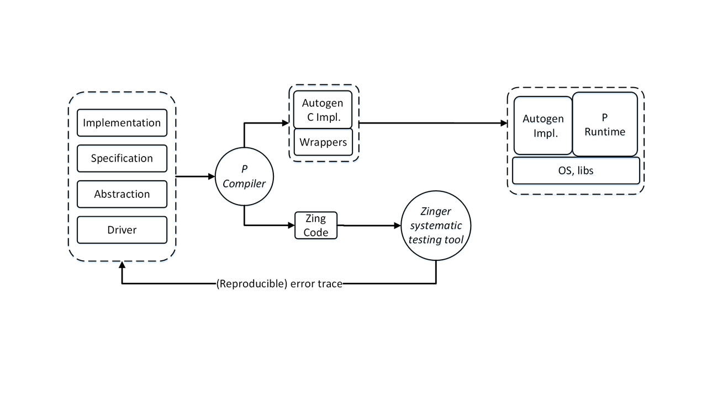

# The P Manual
Ethan Jackson: ejackson@microsoft.com
Shaz Qadeer: qadeer@microsoft.com

## 1. Introduction

P is a domain-specific language for implementing asynchronous event-driven systems. The goal of P
is to provide language primitives to succinctly and precisely capture protocols that are inherent to
communication among components in asynchronous systems. The computational model underlying a
P program is state machines communicating via messages, an approach commonly used in building
embedded, networked, and distributed systems. Each state machine has an input queue, states,
transitions, event handlers, and machine-local store for a collection of variables. The state machines
run concurrently with each other, each executing an event handling loop that dequeues a message
from the input queue, examines the local store, and can execute a sequence of operations. Each
operation either updates the local store, sends messages to other machines, or creates new machines.
In P, a send operation is non-blocking; the message is simply enqueued into the input queue of the
target machine.

In the rest of this tutorial, we will introduce the features of P through a series of examples.
We will first present a simple program (Section 2) that illustrates the basics of the state machine
programming model. Next, we present a more sophisticated example of a failure detection protocol
(Section 3) that illustrates advanced features of the P language. P is a domain-specific language
for implementing protocols in an asynchronous application; it is expected that the parts of the
application other than the protocols would be written in a host language such as C. We will describe
the foreign code interface important for interoperability between P code and foreign code written
in C (Section 4). Finally, we will provide an overview of the tools for processing a P program
(Section 5) and conclude with a glossary of all features in the P language (Section 6).

## 2. The Ping Pong Program

A P program is a collection of event and machine declarations. Here is a basic P program containing
a Client machine and a Server machine communicating with each other via Ping and Pong events.

```
// PingPong.p
event PING assert 1: machine;
event PONG assert 1;
event SUCCESS;

main machine Client {
  var server: machine;
  
  1start state Init {
    entry {
       server = new Server();
       raise SUCCESS;
    }
    on SUCCESS goto SendPing;
  }
  
  state SendPing {
    entry {
      send server, PING, this;
      raise SUCCESS;
    }
    on SUCCESS goto WaitPong;
  }
  
  state WaitPong {
    on PONG goto SendPing;
  }
}

machine Server {
  start state WaitPing {
    on PING goto SendPong;
  }
  
  state SendPong {
    entry (payload: machine) {
      send payload, PONG;
      raise SUCCESS;
    }
    on SUCCESS goto WaitPing;
  }
}
```

We now take a closer look at the event and machine declarations in this program. The declaration
of event `PING` indicates that it is accompanied with a data value of `machine` type. The `machine`
type contains the addresses of all dynamically-created P machines. This declaration also indicates
that at most one instance of the `PING` event may be present in the input queue of any machine.

A machine declaration contains a collection of variable and state declarations. For example, the
machine `Client` has a variable server and three states, `Init`, `SendPing`, and `WaitPong`, declared
inside it. The storage for the server variable is local to a particular instance of the `Client` machine.
State `Init` is declared to be the start state to indicate that an instance of `Client` begins executing
by entering the `Init` state.

There can be many different declarations inside a state. A code block indicated by `entry { ...
}` is executed when the state is entered. Similarly, a code block indicated by `exit { ... }` (not used
in our example) is executed when the state is exited. Other than these two declarations, all other
declarations inside a state are related to event handling. The declaration on `SUCCESS goto SendPing`
in state `Init` is an example of such a declaration indicating that the `SUCCESS` event must be handled
by moving to state `SendPing`. Different states can choose to handle a particular event differently.
For example, state `Init` handles `SUCCESS` by moving to state `SendPing` but state `SendPing` handled
`SUCCESS` by moving to state `WaitPong`.

Next, we look at the contents of the entry code block in state `Init` of machine Client. This code
block has two statements. The first statement creates an instance of the Server machine and stores
the address of this instance in variable `server`. The second statement raises an event `SUCCESS` which
causes control to exit `Init` and enter `SendPing`. In P, when a machine sends an event to another
machine (or itself), the event is enqueued in the target machine’s input queue. However, a raised
event does not go through the queue; rather it terminates execution of the enclosing code block and
is handled immediately.

The entry code block in state `SendPing` shows a use of the `send` statement for sending a `PING`
event to the machine whose address is stored in the variable `server`. The keyword `this` evaluates to
the address of the machine executing the current statement.

Finally, the entry code block in state `SendPong` of machine `Server` shows that the data value
associated with a received event can be retrieved through a parameter of the apppriate type to the
event handler. In this code block, the payload parameter evaluates to the data attached to the
`PING` event whose handling caused control to enter `SendPong`. This data value is the address of the
instance of `Client` machine that sent the `PING` event. A parameter is similarly used to retrieve the
argument to the constructor of a freshly-created machine when it starts execution in the entry block
of its `start` state.

The attentive reader might be wondering how the PingPong program begins execution. The
machine `Client` is annotated with `main` to indicate that program execution begins with a single
instance of `Client` entering state `Init`. Let us call this machine X. The machine X creates an
instance of `Server` and raises `SUCCESS` to enter state `SendPing`. Let us call this `Server` instance Y;
it begins execution in state `WaitPing` of `Server`. From this point on, X and Y exchange `PING` and
`PONG` messages, where X cycles between `SendPing` and `WaitPong` and Y cycles between `WaitPing`
and `SendPong`.

The most important safety specification of a P program is that every event dequeued by a machine
is handled; otherwise, the P runtime throws an `UnhandledEvent` exception. The PingPong program
satisfies this specification since the `Server` machine handles the `PING` event and the `Client` machine
handles the `PONG` event in every state where an event dequeue is possible.

In order to terminate a state machine cleanly, there is a special `halt` event. Termination of a
machine due to an unhandled `halt` event is valid behavior and does not throw an `UnhandledEvent`
exception. Therefore, a machine can be halted by queuing a `halt` event to it. From the point of view
of formal operational semantics, a halted machine is fully receptive and consumes any event that is
sent to it. The P runtime implements this semantics efficiently by cleaning up resources allocated
to a halting machine and recording that the machine has halted. An event sent to a halted machine
is simply dropped. A halted machine cannot be restarted; it remains halted forever.

## 3. FailureDetect Program

We look at a more sophisticated program to illustrate other features of the P language. This program
implements a failure detection protocol. A failure detector state machine is given a list of machines,
each of which represents a daemon running at a computing node in a distributed system. The failure
detector sends each machine in the list a `PING` event and determines whether the machine has failed
if it does not respond with a `PONG` event within a certain time period. The failure detector uses an
OS timer to implement the bounded wait for the `PONG` event.

### 3.1 `Timer` Machine

We begin by showing the code for the `Timer` machine. The `Timer` machine is declared using the
keyword `model` to indicate that it represents an abstraction of the OS timer. This abstraction is used
to test the interaction of the failure detector protocol with the OS. For executing the protocol, its
interaction with the `Timer` machine is replaced with stubs for which the programmer must provide
hand-written C code.

```
// Timer.p
// events from client to timer
event START: int;
event CANCEL;
// events from timer to client
event TIMEOUT: machine;
event CANCEL_SUCCESS: machine;
event CANCEL_FAILURE: machine;
// local event for control transfer within timer
event UNIT;

model Timer {
  var client: machine;
  
  start state Init {
    entry (payload: machine) {
      client = payload;
      raise UNIT; // goto handler of UNIT
    }
    on UNIT goto WaitForReq;
  }
  
  state WaitForReq {
    on CANCEL goto WaitForReq with {
      send client, CANCEL_FAILURE, this;
    };
    on START goto WaitForCancel;
  }

  state WaitForCancel {
    ignore START;
    on CANCEL goto WaitForReq with {
      if ($) {
        send client, CANCEL_SUCCESS, this;
      } else {
        send client, CANCEL_FAILURE, this;
        send client, TIMEOUT, this;
      }
    };
    on null goto WaitForReq with {
      send client, TIMEOUT, this;
    };
  }
}
```

Each instance of a `Timer` machine has a client whose address is stored in the `client` variable.
This client sends `START` and `CANCEL` events to the timer machine which responds via `TIMEOUT`,
`CANCEL_SUCCESS`, or `CANCEL_FAILURE` events.

The `Timer` machine has three states. It starts executing in state `Init` where it initializes
the client variable with the client’s address obtained by looking up paylaod. It waits in state
`WaitForReq` for a request from the client, responding with `CANCEL_FAILURE` to a `CANCEL` event and
moving to `WaitForCancel` state on `START` event.

In `WaitForCancel` state, any `START` event is dequeued and dropped without any action (indi-
cated by `ignore` keyword). The response to a `CANCEL` event is nondeterministic to model the race
condition between the arrival of a `CANCEL` event from the client and the elapse of the timer. This
nondeterminism is indicated by an `if` statement guarded by `$`. The `then`-branch models the case
when the `CANCEL` event arrives before the timer elapses; in this case, `CANCEL_SUCCESS` is sent back to
the client. The `else`-branch models the case when the timer fires before the `CANCEL` event arrives; in
this case, `CANCEL_FAILURE` and `TIMEOUT` are sent back to the client one after another. The last event
handler `on null goto WaitForReq with { ... }` transfers the control to `WaitForReq`, modeling
that the timer has elapsed, if neither of the other event handlers in `WaitForCancel` can execute.
The event `null` is a special event that is internally generated in the runtime in this case.

### 3.2 Failure Detection Protocol

The failure detection protocol depends on the `Timer` machines and is based on the interaction of two
kinds of machines—`FailureDetector` and `Node`—shown below. The code of the `FailureDetector`
machine shows more features of P, including container types, functions, `do` actions, `push` transitions
and pop statements, deferred events, and monitors.

P supports container types, including tuples, named tuples or structs, sequences, and maps.
The type `(t1,...,tn)` is a tuple with n elements of type `t1` through `tn` respectively. The type
`(f1:t1,...,fn:tn)` is a struct with fields `f1` through `fn` of types `t1` through `tn` respectively. The
type `seq[T]` is an extensible sequence of values of type `T`, e.g., variable nodes of type `seq[machine]`.
The type `map[K,V]` is a map from key type `K` to value type `V`, e.g., variable clients of type
`map[machine,int]`. P currently does not support the set type but `map[T,bool]` can be used instead
of `set[T]`. P also supports functions that can be invoked from any code block. A function can have
named parameters that are local to its body.

State `Init` illustrates the use of `push` transitions. After appropriately initializing variables in
the entry block, the raised event `UNIT` is handled by pushing state `SendPing` on top of the current
state `Init`. Thus, the use of push transitions creates a stack of states encoding the control of a state
machine. As long as state `Init` is on the stack, event handlers declared inside it are available to be
executed regardless of changes in control state above it. The event handlers for `REGISTER_CLIENT`
and `UNREGISTER_CLIENT` are such handlers. A `push` transition from `Init` to `SendPing` (rather than
a `goto` transition) enables the declaration of these handlers in one place with reuse everywhere else
in `FailureDetector`. In addition to offering reuse of event handlers, `push` transitions also enable
reuse of protocol logic for handling specific interactions with other machines. We later explain this
use of a `push` transition in handling the interaction between `FailureDetector` and `Timer`.

State `SendPing` illustrates several new features of P. When this state is entered, its entry block
sends `PING` events to all alive nodes that have not yet responded with a `PONG` and starts a timer with
a timeout value of 100ms. The machine stays in this state collecting `PONG` responses until either all
alive nodes have responded or a `TIMEOUT` event is dequeued. If each alive node has responded with
a `PONG` before `TIMEOUT` is dequeued, the timer is canceled and the event `TIMER_CANCELED` is raised.
Otherwise, the handler of `TIMEOUT` is executed to determine whether another attempt to reach the
potentially alive nodes should be made. If number of attempts has reached the maximum number
of attempts (2 in our code), failure notifications are sent.

```
// FailureDetector.p
include "Timer.p"

// request from failure detector to node
event PING: machine;
// response from node to failure detector
event PONG: machine;
// register a client for failure notification
event REGISTER_CLIENT: machine;
// unregister a client from failure notification
event UNREGISTER_CLIENT: machine;
// failure notification to client
event NODE_DOWN: machine;
// local events for control transfer within failure detector
event ROUND_DONE;
event TIMER_CANCELED;

machine FailureDetector {
  var nodes: seq[machine];            // nodes to be monitored
  var clients: map[machine, bool];    // registered clients
  var attempts: int;                  // number of PING attempts made
  var alive: map[machine, bool];      // set of alive nodes
  var responses: map[machine, bool];  // collected responses in one round
  var timer: machine;                 

  start state Init {
    entry (payload: seq[machine]) {
      nodes = payload;
      InitializeAliveSet();

      // initialize alive to the members of nodes
      timer = new Timer(this);
      raise UNIT;
    }
    on REGISTER_CLIENT do (payload: machine) { clients[payload] = true; };
    on UNREGISTER_CLIENT do (payload: machine) { if (payload in clients) clients -= payload; };
    on UNIT push SendPing;
  }

  state SendPing {
    entry {
      SendPings();
      
      // send PING events to machines that have not responded
      send timer, START, 100; // start timer for intra-round duration
    }
    on PONG do (payload: machine) {
      // collect PONG responses from alive machines
      if (payload in alive) {
        responses[payload] = true;
        if (sizeof(responses) == sizeof(alive)) {
          // status of alive nodes has not changed
          send timer, CANCEL;
          raise TIMER_CANCELED;
        }
      }
    };
    on TIMER_CANCELED push WaitForCancelResponse;
    on TIMEOUT do {
      // one attempt is done
      attempts = attempts + 1;
      
      // maximum number of attempts per round == 2
      if (sizeof(responses) < sizeof(alive) && attempts < 2) {
        raise UNIT;
        // try again by re-entering SendPing
      } else {
        Notify();

        // send any failure notifications
        raise ROUND_DONE;
      }
    };
    on UNIT goto SendPing;
    on ROUND_DONE goto Reset;
  }

  state WaitForCancelResponse {
    defer TIMEOUT, PONG;
    on CANCEL_SUCCESS do { raise ROUND_DONE; };
    on CANCEL_FAILURE do { pop; };
  }

  state Reset {
    entry {
      // prepare for the next round
      attempts = 0;
      responses = default(map[machine, bool]);
      send timer, START, 1000; // start timer for inter-round duration
    }
    on TIMEOUT goto SendPing;
    ignore PONG;
  }
  
  fun InitializeAliveSet() {
    var i: int;
    i = 0;
    while (i < sizeof(nodes)) {
      alive += (nodes[i], true);
      i = i + 1;
    }
  }

  fun SendPings() {
    var i: int;
    i = 0;
    while (i < sizeof(nodes)) {
      if (nodes[i] in alive && !(nodes[i] in responses)) {
        monitor M_PING, nodes[i];
        send nodes[i], PING, this;
      }
      i = i + 1;
    }
  }

  fun Notify() {
    var i, j: int;
    i = 0;
    while (i < sizeof(nodes)) {
      if (nodes[i] in alive && !(nodes[i] in responses)) {
        alive -= nodes[i];
        j = 0;  
        while (j < sizeof(clients)) {
          send keys(clients)[j], NODE_DOWN, nodes[i];
          j = j + 1;
        }
      }
      i = i + 1;
    }
  }
}

machine Node {
  start state WaitPing {
    on PING do (payload: machine) {
      send payload, PONG, this;
    };
  }
}

event M_PING: machine;

spec Safety monitors M_PING, PONG {
  var pending: map[machine, int];
  
  start state Init {
    on M_PING do (payload: machine) {
      if (!(payload in pending))
      pending[payload] = 0;
      pending[payload] = pending[payload] + 1;
      assert (pending[payload] <= 3);
    };
    on PONG do (payload: machine) {
      assert (payload in pending);
      assert (0 < pending[payload]);
      pending[payload] = pending[payload] - 1;
    };
  }
}
```

State `SendPing` illustrates the use of `do` actions. The handler for `PONG` in `SendPing` is indicated by
the code `on PONG do { ... }`, which states that the code block between the braces must be executed
when `PONG` is dequeued. Control remains in the state `SendPing` subsequent to this execution. This
control primitive is useful for executing an event-driven loop in a state, such as the one in `SendPing`
for collecting `PONG` responses.

State `SendPing` also illustrates the use of a `push` transition to factor out the logic for handling
timer cancelation. When `TIMER_CANCELED` is raised after canceling the timer because all alive nodes
have responded with `PONG`, the handler `on TIMER_CANCELED push WaitForCancelResponse` pushes
the state `WaitForCancelResponse` on top of `SendPing`. The state `WaitForCancelResponse` handles
the interaction with the timer subsequent to its cancelation, returning control back to `SendPing`
afterwards. The timer may respond with either `CANCEL_SUCCESS` or `CANCEL_FAILURE`. In the former
case, the event `ROUND_DONE` is raised which is not handled in state `TIMER_CANCELED` causing it to
be popped and letting `SendPing` handle that event. In the latter case, the `pop` statement executes
causing `TIMER_CANCELED` to be popped and a fresh event being dequeued in state `SEND_PING`.

The state `WaitForCancelResponse` uses the code defer `TIMEOUT`, `PONG` to indicate that it is not
willing to handle `TIMEOUT` and `PONG` states in this state. Therefore, while the machine is blocked in
this state, the P runtime does not dequeue these two events, instead skipping over them to retrieve
any other event in the input queue.

When the `FailureDetector` machine is blocked in the state `WaitForCancelResponse`, its stack
has three states on it. Starting from the bottom of the stack, these states are `Init`, `SendPing`,
and `WaitForCancelResponse`. The `Init` state specifies do handlers for `REGISTER_CLIENT` and
`UNREGISTER_CLIENT`, the `SendPing` state specifies `do` handlers for `PONG` and `TIMEOUT`, and the
`WaitForCancelResponse` state defers `PONG` and `TIMEOUT`. The dequeue logic for P allows the execution 
of `do` handlers specified anywhere in the stack unless deferred in a state above. Therefore, in
state `WaitForCancelResponse`, `REGISTER_CLIENT` and `UNREGISTER_CLIENT` may be dequeued but
`TIMEOUT` and `PONG` may not.

P allows programmers to write assertions in code blocks to express invariants on state local to a
machine. It is often useful to be able to write assertions about state across machines in a program. P
provides monitors to write such specifications. Consider the problem of specifying that the difference
in the number of `PING` events sent to any node can never be three more than the number of `PONG`
events sent by it. We can code this specification using the state machine `Safety`. This machine
maintains the difference between the number of `PING` and `PONG` events per node in a map and asserts
that this number can be at most three. A specification state machine must explicitly mention the
events monitored by it. For example, the `Safety` specification monitors `M_PING` and `PONG` events.
An event sent from one machine to another using the send statment is automatically routed to
any specification that monitors it. Although monitored events are most commonly program events
sent from one state machine to another, sometimes it is important to introduce events specifically
for the purpose of monitoring. The event `M_PING` is such an event. This event is generated by the
failure detector using the statment `monitor M_PING, nodes[i]` right before it sends a `PING` event to
`nodes[i]`. Unlike the `PING` event whose payload is the identifier of the failure detector, the payload
of the `M_PING` event is the identifier of the target node. Using the payloads of `M_PING` and `PONG`, the
`Safety` machine is able to implement its per-node check.

### 3.3. Test Driver

Machine `Driver` shows how to write a test driver to test the failure detection protocol. This machine
models a client of the protocol. This client creates a few nodes to be monitored, creates an instance
of the `Safety` monitor, and instance of the `Liveness` monitor (explained later), an instance of
`FailureDetector`, registers itself with the created instance of `FailureDetector`, and then enqueues
the special `halt` event to each node created by it. The `halt` event is special because termination of
a machine due to unhandled `halt` event is expected behavior and does not raise `UnhandledEvent`
exception. Since the `Node` machine does not handle the `halt` event, it will be terminated. Thus, the
`Driver` machine creates a finite test program for the failure detection protocol.

```
// TestDriver.p
include "FailureDetector.p"

main model Driver {
  var fd: machine;
  var nodeseq: seq[machine];
  var nodemap: map[machine, bool];

  start state Init {
    entry {
      Init(0, null);
      monitor M_START, nodemap;
      fd = new FailureDetector(nodeseq);
      send fd, REGISTER_CLIENT, this;
      Fail(0);
    }
    ignore NODE_DOWN;
  }

  fun Init(i: int, n: machine) {
    i = 0;
    while (i < 2) {
      n = new Node();
      nodeseq += (i, n);
      nodemap += (n, true);
      i = i + 1;
    }
  }
  
  fun Fail(i: int) {
    i = 0;
    while (i < 2) {
      send nodeseq[i], halt;
      i = i + 1;
    }
  }
}

event M_START: map[machine, bool];

spec Liveness monitors M_START, NODE_DOWN {
  var nodes: map[machine, bool];
  
  start state Init {
    on M_START goto Wait;
  }

  hot state Wait {
    entry (payload: map[machine, bool]) {
      nodes = payload;
    }
    on NODE_DOWN do (payload: machine) {
      nodes -= payload;
      if (sizeof(nodes) == 0)
        raise UNIT;
    };
    on UNIT goto Done;
  }

  state Done { }
}
```

Even though the test program encoded by machine `Driver` is finite, it can generate an enormous number
of behaviors resulting primarily from the concurrent execution of a number of state machines—
one `Driver` machine, two `Node` machines, one `FailureDetector` machine, and one `Timer` machine.
At each step in an execution when a non-local action (creation of a machine or sending an event
from one machine to another) action is about to execute, there is a choice of picking any one of these
machines to execute. The testing tool underlying P systematically enumerates these behaviors; if
an exception is raised or an assertion is violated, a path to the error is reported to the programmer.

The style of specifying test programs in the manner described above results in a compact description
of a large set of test executions, considerably reducing programmer effort in specifying
and generating them. For example, even though the Driver machine sends a halt event to each
`Node` machine immediately after creating them, these send actions may be arbitrarily “delayed” if
a nondeterministic scheduler chooses to execute the other machines in the program instead. The
systematic testing tool underlying P has the capability to enumerate such behaviors.

In addition to safety specifications, P also allows programmers to express liveness specifications
such as absence of deadlocks and livelocks in the test program. The simplest characterization of a
deadlock is a finite execution at the end of which no machine is enabled, that is, every machine is
either halted or blocked waiting for an event. However, not all such executions would typically be
considered erroneous. To further refine the specification of bad behaviors, a liveness monitor allows
certain states to be marked as hot states; if a monitor is in a hot state at the end of a deadlock
execution, this execution is reported as an error.

As an example, consider the `Liveness` monitor in the figure above. This monitor starts in the
state `Init` and transitions to state `Wait` upon receiving the event `M_START`. In the entry function of
`Wait`, the machine with the nodes variable initialized to the set of addresses of all `Node` machines in
the program. Whenever the `Driver` machine receives a `NODE_DOWN` event from the `FailureDetector`
machine, it forwards that event to the `Liveness` monitor which then removes the machine whose
failure was detected from the set in nodes. The monitor exits the hot `Init` state only when all
nodes becomes empty, i.e., when the failure of all `Node` machines has been detected. Thus, this
monitor expresses the specification that failure of every `Node` machine must be eventually detected,
a reasonable expectation since the `Driver` machine sends a `halt` event to every `Node` machine.

Occasionally, a violation of liveness results not from a deadlock in a finite execution but from
an infinite execution in which one or more machines each may be taking steps but program is
not making progress as a whole. A liveness monitor with hot states specifies such infinite erroneous
behaviors also; an infinite execution is erroneous if the monitor is in a hot state infinitely often in the
execution. With only hot states, a monitor can specify “eventually” properties, i.e., something good
happens eventually. To generalize liveness monitors to “infinitely-often” properties, i.e., something
good happens repeatedly, P supports the notion of `cold` states as well. A monitor with both hot
and cold states specifies an erroneous infinite execution as one which visits some hot state infinitely
often and visits cold states only finitely often.

To understand the meaning of hot and cold states, it is helpful to think in terms of the temper-
ature of an execution. Every step in the execution at the end of which the liveness monitor is in a
hot state increases the temperature of the execution by a small amount. Entering a cold state resets
the temperature to zero. An (infinite) execution is erroneous if its temperature goes to infinity.

## 4. Foreign Code

In Section 3, we presented a failure detection protocol whose implemented used an OS timer for
implementing timeouts. For the purpose of systematic testing, we modeled the OS timer as a model
machine called `Timer`. But for executing the failure detection protocol, we have to write C code
backing `Timer`. We call this code foreign code.

The P compiler emits the following C function prototypes for the `Timer` machine.

```
void P_CTOR_Timer_IMPL(PRT_MACHINEINST *context, PRT_VALUE *value);
void P_DTOR_Timer_IMPL(PRT_MACHINEINST *context);
void P_SEND_Timer_IMPL(PRT_MACHINEINST *context, PRT_VALUE *evnt, PRT_VALUE *payload);
```

The functions `P_CTOR_Timer_IMPL` and `P_DTOR_Timer_IMPL` are the constructor and desctructor
respectively of the C data structures representing an instance of `Timer`. The constructor is invoked
when the statement new `Timer`(`this`) is invoked. The destructor is invoked when a previously
created `Timer` machine is halted. The function `P_SEND_Timer_IMPL` implements the operation of
queueing an event into a `Timer` machine. The following code shows an example of how to implement
`Timer` using Win32 APIs.

```cpp
// P runtime library APIs used in this code
PRT_API PRT_VALUE * PRT_CALL_CONV PrtCloneValue(_In_ PRT_VALUE *value);
PRT_API void PRT_CALL_CONV PrtFreeValue(_Inout_ PRT_VALUE *value);
PRT_API PRT_VALUE * PRT_CALL_CONV PrtMkEventValue(_In_ PRT_UINT32 value);
PRT_API void PRT_CALL_CONV PrtSend(_Inout_ PRT_MACHINEINST *machine,
                                   _In_ PRT_VALUE *evt,
                                   _In_ PRT_VALUE *payload);
PRT_API void PRT_CALL_CONV PrtAssert(_In_ int condition,
                                     _In_opt_z_ PRT_CSTRING message);
                                     
// Timer.c
typedef struct TimerContext {
  PRT_VALUE *client;
  HANDLE timer;
} TimerContext;

void P_CTOR_Timer_IMPL(PRT_MACHINEINST *context, PRT_VALUE *value)
{
  printf("Entering P_CTOR_Timer_IMPL\n");
  TimerContext *timerContext = (TimerContext *) malloc(sizeof(TimerContext));
  timerContext→client = PrtCloneValue(value);
  timerContext→timer = CreateWaitableTimer(NULL, TRUE, NULL);
  PrtAssert(timerContext→timer != NULL, "CreateWaitableTimer failed");
  context→extContext = timerContext;
}

void P_DTOR_Timer_IMPL(PRT_MACHINEINST *context)
{
  printf("Entering P_DTOR_Timer_IMPL\n");
  TimerContext *timerContext;
  timerContext = (TimerContext *) context→extContext;
  PrtFreeValue(timerContext→client);
  CloseHandle(timerContext→timer);
  free(timerContext);
}

VOID CALLBACK Callback(LPVOID arg, DWORD dwTimerLowValue, DWORD dwTimerHighValue)
{
  PRT_MACHINEINST *context = (PRT_MACHINEINST *) arg;
  TimerContext *timerContext = (TimerContext *) context→extContext;
  PRT_VALUE *ev = PrtMkEventValue(P_EVENT_TIMEOUT);
  PrtSend(PrtGetMachine(context→process, timerContext→client), ev, context→id);
  PrtFreeValue(ev);
}
  
void P_SEND_Timer_IMPL(PRT_MACHINEINST *context, PRT_VALUE *evnt, PRT_VALUE *payload)
{
  printf("Entering P_SEND_Timer_IMPL\n");
  PRT_VALUE *ev;
  BOOL success;
  TimerContext *timerContext = (TimerContext *) context→extContext;
  LARGE_INTEGER liDueTime;
  liDueTime.QuadPart = -10000 * payload→valueUnion.nt;
  if (evnt→valueUnion.ev == P_EVENT_START) {
    printf("Timer received START\n");
    success = SetWaitableTimer(timerContext→timer, &liDueTime, 0, Callback, context, FALSE);
    PrtAssert(success, "SetWaitableTimer failed");
  } else if (evnt→valueUnion.ev == P_EVENT_CANCEL) {
    printf("Timer received CANCEL\n");
    success = CancelWaitableTimer(timerContext→timer);
    if (success) {
      ev = PrtMkEventValue(P_EVENT_CANCEL_SUCCESS);
      PrtSend(PrtGetMachine(context→process, timerContext→client), ev, context→id);
    } else {
      ev = PrtMkEventValue(P_EVENT_CANCEL_FAILURE);
      PrtSend(PrtGetMachine(context→process, timerContext→client), ev, context→id);
    }
    PrtFreeValue(ev);
  } else {
    PrtAssert(FALSE, "Illegal event");
  }
}
```

Each timer instance is represented by an object of type `TimerContext` which contains a pointer back
to the client machine and an OS handle representing a Win32 timer. The constructor creates and
initializes this object and stashes a pointer to it in the `extContext` field of a `PRT_MACHINEINST` passed
as the first argument to the contructor. The destructor frees the allocated OS and memory resources.
The `PRT_MACHINEINST` type and many other types and functions referred to in the code above are
defined in the P runtime library; these definitions can be obtained by including a file "program.h"
generated automatically by the P compiler. The `P_SEND_Timer_IMPL` function converts P events
such as `START` and `CANCEL` to appropriate invocations of the OS timer APIs. It also converts any
values returned by these APIs into events enqueued back to the client.

## 5. Tools



The typical workflow associated with using the P programming system is shown in the figure
above. The programmer provides a P program (shown on the left of the figure) as input to the
P compiler. The compiler runs a lightweight static analysis which may produce error messages.
Once the programmer fixes all the statically discovered errors, the compiler produces two outputs—
C code for execution and Zing model for systematic testing. The latter output comprises both the
Zing model and a compiled version of it in the form of a .NET assembly. Next, the programmer feeds
this .NET assembly to the Zinger tool which tests the program along various interleaved executions.
If a dynamic error is discovered, a complete error trace starting from the initial state of the program
is dumped on the disk in a text file (see -et option of Zinger). The programmer fixes the bug and
runs the compiler and Zinger again on the modified program. At any point in this process, the
programmer could also choose to compile the generated C code along with the foreign code and run
it.

In addition to the compiler and testing tool, the P distribution also has a visualizer to graphically
display the state machine structure of the P code. The visualization is a useful aid in program
comprehension, especially when the number of states and transitions become large.
The P distribution is available in four configurations given by the matrix {Debug, Release} ×
{x86, x64}. For example, the folder for Debug tools under x86 is called *Plang_Debug_x86*. Inside
this folder, there are two sub-folders—Compiler and Runtime. The Compiler folder contains all the
tools for visualizing, compiling, and testing a P program. The Runtime folder contains the binaries
and header files for the P runtime library. To generate the executable binary for the P program, a
standard C compiler is used to compile the auto-generated and manually-written code against the
header files and then link against the P runtime library.

### 5.1. Visualization

The visualizer is launched by running *PVisualizer.exe* from the command line. A P file can be
loaded (and refreshed) through the drop-down menu at the top.

### 5.2. Compilation

The compiler executable is called *pc.exe*. It takes a P file and optional arguments as input. The
options can be discovered by running *pc.exe* /? from the command line. When the command
`pc.exe foo.p` is run, four files are generated—*foo.dll*, *program.h*, *program.c*, and *stubs.c*.
The first file is intended for systematically testing the (potentially nondeterministic) executions of
*foo.p* (discussed in Section 5.3). The last three files are intended for executing *foo.p* (discussed in
Section 5.4).

### 5.3. Systematic Testing

To test a P program systematically along different execution paths, the programmer must run
*Zinger.exe* on the dll generated by the P compiler, e.g. `Zinger.exe foo.dll. Run Zinger.exe /?`
to get the full list of options for Zinger. A good set of default options are as follows:

`-s -delayB:<PlangDist>\Compiler\RunToCompletionDelayingScheduler.dll -et:trace.txt`

With these options, Zinger prints search statistics periodically (-s option), uses the Run-To-Completion
delaying scheduler for search (`-delayB` option), and prints the trace for any error discovered in the
file trace.txt (`-et` option). The detection of infinite erroneous executions (in the presence of liveness 
monitors) is not turned on by default because it is expensive. To turn that feature on, use the
`-liveness` option.

### 5.4. Execution

The Runtime folder contains two sub-folders—Headers and Lib. The Headers folder contains C
header files required for compiling the outputs *program.h*, *program.c*, and *stubs.c*. The Lib folder
contains a dynamically-loaded dll for the P runtime. To execute your application, fill in the missing
functions in *stubs.c* (resulting from the use of model machines and functions) and compile your
application using the standard C compiler.

## 6. Glossary

### 6.1. Types

| **Syntax** | **Description** |
|:-----------|:----------------|
|`null`      | Contains only the null value |
|`bool`      | Contains only true and false; default is false. |
|`int`       | 32-bit signed integers; default is 0. |
|`event` |The set of all event constants and null, which is the default.|
|`machine` | The set of all possible machine ids and null, which is the default.|
|`foreign` | The set of all foreign values.|
|(t<sub>1</sub>,..., t<sub>n</sub>)|The set of all n-ary tuples with arguments of types t 1 , ..., t n .|
|(id<sub>1</sub> : t<sub>1</sub>,..., id<sub>n</sub>:t<sub>n</sub>)| The set of all n-ary named tuples with arguments of types t 1 , ..., t n .|
|`seq[t]`|The set of all finite sequences over type `t`.|
|`map[k, v]`|The set of all finite maps from values of type `k` to type `v` .|
|`any`|The set of all values that can appear in this program; null is default.|

### 6.2. Machines and Events

| **Syntax** | **Description** |
|:-----------|:----------------|
|`null`|A pseudo-event that may be taken when no other event is triggered.|
|`halt`|A predefined event that causes a machine to shutdown.|
|`event e [ {assert \| assume} k] [:t];`|Declares an event e (with payload type t).|
|`[main] machine M [ {assert \| assume} k] { ... }`|Declares a (main) class M of machines.[^a]|
|`[main] model M [ {assert \| assume} k] { ... }`|Declares a (main) class M of models.[^b]|
|`monitor M { ... }`|Declares a class M of property monitors.|

[^a]: An event e may optionally be annotated with `assert k` or `assume k`. The former specifies that
there must not be more than k instances of e in the input queue of any machine. The latter specifies
that during systematic testing using Zinger, an execution that increases the cardinality of e beyond k
in some queue must not be generated. Both compile to an assertion in code generated for execution.

[^b]: A machine or model M may optionally be annotated with `assert k` or `assume k`. Their
meaning is similar to that of the corresponding annotation for an event except that the bound k
refers to the total number of events in the input queue of M.

### 6.3. States, State Variables, and Functions (declared inside machines)

| **Syntax** | **Description** |
|:-----------|:----------------|
|`this`|Variable containing the unique address of this machine.|
|`trigger`|Variable containing event causing entry or exit of a state.|
|`payload`|Variable containing the payload of event causing entry or exit of a state.|
|`var id<sub>1</sub>,..., id<sub>n</sub> : t`|Declares state variables id<sub>1</sub>,..., id<sub>n</sub> of type `t` initialized to default(t)|
|`[start] [ cold \| hot ] state S { ... }`|Declares a (starting) (cold or hot) state S.|
|`group G { ... }`|Declares a group G containing a nested list of groups and states.|
|`[model] fun F (id<sub>1</sub> : t<sub>1</sub>,..., id<sub>n</sub> : t<sub>n</sub>) [: t] { ... }`|Declares a (model) function F with parameters id 1 , ..., id n that returns a value of type t.|

### 6.4. State Actions and Transitions (declared inside states)

| **Syntax** | **Description** |
|:-----------|:----------------|
|`entry F;`|A function F to be executed whenever this state is entered.|
|`entry { ... }`|A code block to be executed whenever this state is entered.|
|`exit F;`|A function F to be executed whenever this state is exited.|
|`exit { ... }`|A code block to be executed whenever this state is exited.|
|`defer e<sub>1</sub>,..., e<sub>n</sub>;`|A list of events to skip over while examining queue for an event to handle.|
|`ignore e<sub>1</sub>,..., e<sub>n</sub>;`|A list of events to immediately remove while examining queue for an event to handle.|
|`on e<sub>1</sub>,..., e<sub>n</sub> do F;`|A list of events to immediately remove while examining queue for an event to handle.|
|`on e<sub>1</sub>, ..., e<sub>n</sub> do { ... }`|A list of events to immediately remove while examining queue for an event to handle.|

### 6.5. Statements

| **Syntax** | **Description** |
|:-----------|:----------------|
|`x = v`;|Updates state variable x to the result of v.|
|`lhs.i = v;`|Updates the i-th argument of the (named) tuple in lhs to the result of v.|
|`lhs.id = v;`|Updates the argument named id of the named tuple in lhs to the result of v.|
|`lhs[key] = v;`|Updates a map or sequence in lhs at key to the result of v.|
|`lhs -= key;`|Removes key from a map or sequence in lhs.|
|`lhs += (key, v);`|Inserts (key, v) into a map or sequence in lhs.|
|`return [v];`|Immediately exits a function or code block (returning the evaluation of v).|
|`F(v<sub>1</sub>,..., v<sub>n</sub>);`|Calls function F with arguments (v<sub>1</sub>,..., v<sub>n</sub>).|
|`new M(v 1 , ..., v n );`|Creates a new instance of M with payload set to (v<sub>1</sub>,..., v<sub>n</sub>).|
|`assert v;`|Fails if v does not evaluate to true.|
|`while (v) { ... }`|Repeatedly executes code block until v evaluates to false.|
|`if (v) { s } [else { t }]`|Executes s if v evaluates to true (t otherwise).|
|`pop;`|Pops this state from state stack and returns to the parent state. Fails if state stack is empty.|
|`push S;`|Pushes S onto the stack stack, defers all events, and executes the entry action of S.|
|`raise ev [v<sub>1</sub>,..., v<sub>n</sub>];`|Causes immediate handling of event expression ev (and sets payload to (v<sub>1</sub>,..., v<sub>n</sub>)).|
|`send dst, ev [v<sub>1</sub>,..., v<sub>n</sub>];`|Sends to machine expression dst event expression ev (with payload to (v<sub>1</sub>,..., v<sub>n</sub>)).|

